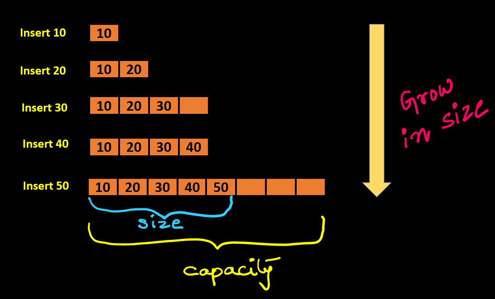
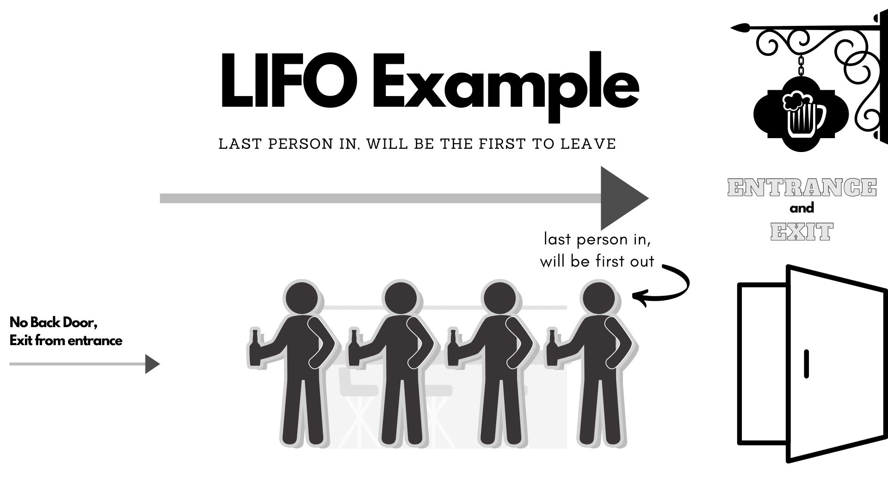
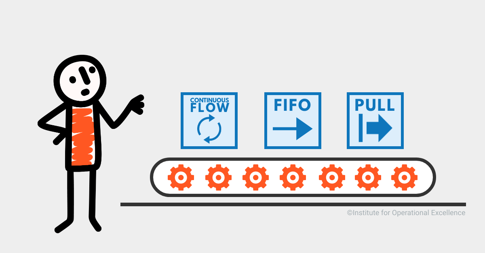
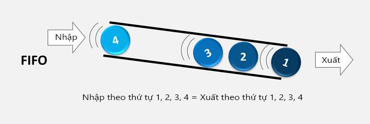
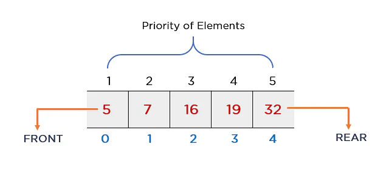
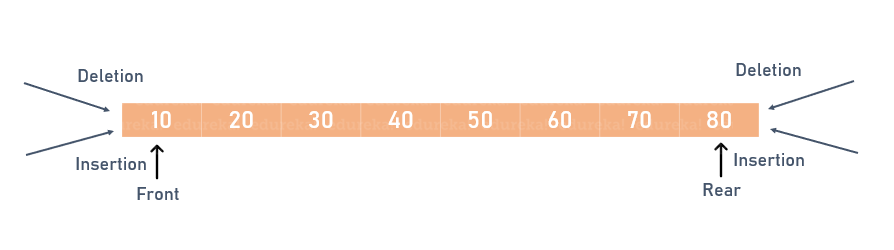
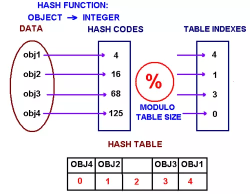
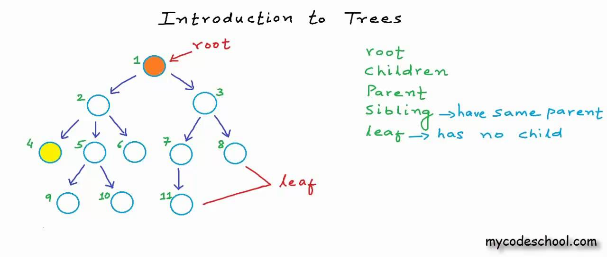

# Collection
##  Collection
 - `Collection` là `framework` cung cấp kiến trúc để lưu và thao tác với `elements` (`objects`) .
 - `Java Collection` cung cấp rất nhiều `interface`  (`Set`, `List`, `Queue`, `Deque`) và `classes` (`ArrayList`,`Vector`, `LinkedList`, `PriorityQueue`, `HashSet`, `LinkedHashSet`, `TreeSet`)
 - Một `Collection` là một `object` chứa các `object`.

## Hierarchy of Collection Framework

- `Package java.util` chứa tất cả các `class` và `interface` của `Collection Framework`.

 <p align = "center">
    
</p>

### `Iterable interface`
- `Iterable interface` là `interface` gốc của tất cả các `Collection` `class`. `Iterable interface` chứa duy nhất một `abstract method`:
```java
    Iterator<T> iterator()
```
- `Method` này trả về một `Iterator` của `type` T.

### `Iterator interface`
- `Iterator interface` cung cấp khả năng lặp qua tất cả các `elements` theo thứ tự tăng dần.
- `Iterator interface` bao gồm các `method`:
```java
public boolean hasNext() // trả lại true nếu Iterator còn element chưa lặp qua

public Object next() // trả lại element hiện tại và di chuyển pointer đến element kế tiếp 

public void remove() // loại bỏ phần element của iterator
```

### `Collection Interface`
 - `Collection Interface` là `interface` mà sẽ được tất cả các `class` của `Collection Framework` triển khai. 
 - `Collection Interface` bao gồm các `method` dùng để thao tác với các `element` của `Collection`:
```java
abstract  boolean add(E e) ; // thêm element e vào Collection

abstract  boolean addAll(Collection<? extends E> c) ;// thêm nhiều element e vào Collection

abstract  boolean  clear(); // loại bỏ toàn bộ element e trong Collection

abstract  boolean  contains(Object o); // kiểm tra Object o có xuất hiện trong Collection không

abstract  boolean  containsAll(Collection<?> c)// kiểm tra các element trong Collection c có trong Collection không

abstract  boolean  isEmpty()// kiểm tra xem Collection có rỗng không

abstract  boolean  remove (Object o) // loại bỏ 1 Object được chỉ định trong Collection

abstract  boolean  removeAll(Collection<?> c)// loại bỏ các element trong Collection theo các element trong Collection c

abstract  boolean  retainAll(Collection<?> c) // loại bỏ các element trong Collection giữ lại  element trong Collection c

abstract  int      size() // trả lại size của Collection

abstract  int      iterator() // trả lại iterator của Collection
```
https://docs.oracle.com/javase/8/docs/api/java/util/Collection.html
### `List Interface`
- `List Interface` là `Collection` có thể lưu các `element` trùng lặp. `List Interface` được triển khai bởi các `class` `ArrayList`, `LinkedList`, `Vector`, và `Stack`.
```java
List <data-type> list1= new ArrayList();  
List <data-type> list2 = new LinkedList();  
List <data-type> list3 = new Vector();  
List <data-type> list4 = new Stack();  
```
- `List Interface` cung cấp các `method` để thao tác với các `element` trong `collection`.
- Ngoài các method đã nêu trên `Collection Interface`, `List Interface` bổ sung thêm các `method` đa dụng khác, xem tại đây:
  https://docs.oracle.com/javase/8/docs/api/java/util/List.html

#### `ArrayList`
- `ArrayList` là 1 trong những `class` triển khai của `List Interface`. `ArrayList` sử dụng 1 mảng động (`dynamic array`) để lưu `elements` và có thể lưu `element` trùng lặp.
- `dynamic array` là `array` mà sẽ tự động tăng sức chứa `capacity` theo `size`.

 <p align = "center">
       

</p>

https://www.geeksforgeeks.org/how-do-dynamic-arrays-work/

- `ArrayList` là  `non-synchronized` và `non-Thread-safe` không an toàn về `thread`, một `object` `ArrayList` có thể truy cập bởi nhiều `thread`.
- `ArrayList` phù hợp để lưu và truy cập `elements`.
```java
import java.util.*;  
class TestJavaCollection1{  
public static void main(String args[]){  
ArrayList<String> list=new ArrayList<String>();//Creating arraylist  
list.add("Ravi");//Adding object in arraylist  
list.add("Vijay");  
list.add("Ravi");  
list.add("Ajay");  
//Traversing list through Iterator  
Iterator itr=list.iterator();  
while(itr.hasNext()){  
System.out.println(itr.next());  
}  
}
```
```shell
Ravi
Vijay
Ravi
Ajay
```
https://docs.oracle.com/javase/8/docs/api/java/util/ArrayList.html

#### `LinkedList`
- `LinkedList` là 1 trong những `class` triển khai của `List Interface`. `LinkedList` sử dụng `doubly linked list` để lưu `elements` và có thể lưu element trùng lặp.
 <p align = "center">
    
</p>

- `LinkedList` là  `non-synchronized` và `non-Thread-safe` không an toàn về `thread`, một `object` `LinkedList` có thể truy cập bởi nhiều `thread`trong cùng 1 thời điểm.
-  `LinkedList` phù hợp để thực hiện các thay đổi trên `elements`. So với `ArrayList`, `LinkedList` chiếm nhiều bộ nhớ hơn và tốn `cache` hơn.
   https://stackoverflow.com/questions/12065774/why-does-cache-locality-matter-for-array-performance

```java
import java.util.*;  
public class TestJavaCollection2{  
public static void main(String args[]){  
LinkedList<String> al=new LinkedList<String>();  
al.add("Ravi");  
al.add("Vijay");  
al.add("Ravi");  
al.add("Ajay");  
Iterator<String> itr=al.iterator();  
while(itr.hasNext()){  
System.out.println(itr.next());  
}  
}  
}  
```
```shell
Ravi
Vijay
Ravi
Ajay
```
https://docs.oracle.com/javase/8/docs/api/java/util/LinkedList.html

#### `Vector`
- `Vector` là 1 trong những `class` triển khai của `List Interface`.`Vector` cũng sử dụng `dynamic array` để lưu `elements`.
- `Vector` là `synchronized` và `Thread-safe`, một `object` `Vector`chỉ có một `thread` truy cập vào một thời điểm.
```java
import java.util.*;  
public class TestJavaCollection3{  
public static void main(String args[]){  
Vector<String> v=new Vector<String>();  
v.add("Ayush");  
v.add("Amit");  
v.add("Ashish");  
v.add("Garima");  
Iterator<String> itr=v.iterator();  
while(itr.hasNext()){  
System.out.println(itr.next());  
}  
}  
}  
```
```shell
Ayush
Amit
Ashish
Garima
```
https://docs.oracle.com/javase/8/docs/api/java/util/Vector.html

#### `Stack`
- `Stack` là `class` con của `Vector`, `Stack` triển khai cấu trúc dữ liệu `LIFO`(`last-in-first-out`).
 <p align = "center">
    
</p>

- Vì là con của `Vector`, `Stack` có tất cả `method` giống như `vector` thêm vào đó là các `methods` liên quan đến `LIFO`:
```java
public E       pop(); // lấy element trên cùng ra

public E       peek() ;// xem element ở top của stack

public boolean push(E e);  // thêm element e vào top của stack

public int     search(E e) ; // xem vị trí của 1 element trong stack

public boolean empty();// xem stack rỗng không
```
```java
import java.util.*;  
public class TestJavaCollection4{  
public static void main(String args[]){  
Stack<String> stack = new Stack<String>();  
stack.push("Ayush");  
stack.push("Garvit");  
stack.push("Amit");  
stack.push("Ashish");  
stack.push("Garima");  
stack.pop();  
Iterator<String> itr=stack.iterator();  
while(itr.hasNext()){  
System.out.println(itr.next());  
}  
}  
}  
```
```shell
Ayush
Garvit
Amit
Ashish
```
https://docs.oracle.com/javase/8/docs/api/java/util/Stack.html

### `Queue Interface`
- `Queue Interface` là `interface` theo cấu trúc `FIFO`(`first-in-first-out`).
- `FIFO`: `element` vào trước sẽ ra trước, vào sau ra sau.
 <p align = "center">
    
    
</p>

- Một số `method` đáng chú ý trong `Queue`:
```java
    E element(); // lấy element ở đầu queue
    boolean offer(E e); // thêm element vào queue
    E peek(); // lấy element ở đầu queue không loại bỏ khỏi queue, trả lại null nếu queue rỗng
    E poll(); //lấy element ở đầu queue và loại bỏ element khỏi queue, trả lại null nếu queue rỗng
    E remove(); // lấy element ở đầu queue và loại bỏ element khỏi queue
```

- `Queue Interface` được triển khai bởi các `class` `PriorityQueue`, `Deque`, và `ArrayDeque`.
```java
Queue<String> q1 = new PriorityQueue();  
Queue<String> q2 = new ArrayDeque();  
```
https://docs.oracle.com/javase/8/docs/api/java/util/Queue.html#element--

#### `PriorityQueue`
- `PriorityQueue` là 1 trong những `class` triển khai của `Queue Interface`. `PriorityQueue` lưu các `elements` vào `Queue` theo mức độ ưu tiên.
- `PriorityQueue` không nhận `element` mang giá trị `null`.
 <p align = "center">
    
</p>

```java
import java.util.PriorityQueue;

public class CreatePriorityQueueStringExample {
    public static void main(String[] args) {
        // Create a Priority Queue
        PriorityQueue<String> namePriorityQueue = new PriorityQueue<>();

        // Add items to a Priority Queue (ENQUEUE)
        namePriorityQueue.add("Lisa");
        namePriorityQueue.add("Robert");
        namePriorityQueue.add("John");
        namePriorityQueue.add("Chris");
        namePriorityQueue.add("Angelina");
        namePriorityQueue.add("Joe");

        // Remove items from the Priority Queue (DEQUEUE)
        while (!namePriorityQueue.isEmpty()) {
            System.out.println(namePriorityQueue.remove());
        }

    }
}
```
```shell
Angelina
Chris
Joe
John
Lisa
Robert
```
- Custom `PriorityQueue` bằng `Comparator`:
```java
// Java program to demonstrate working of 
// comparator based priority queue constructor
import java.util.*;

public class Example {
	public static void main(String[] args){
		Scanner in = new Scanner(System.in);
		// Creating Priority queue constructor having 
		// initial capacity=5 and a StudentComparator instance 
		// as its parameters
		PriorityQueue<Student> pq = new
			PriorityQueue<Student>(5, new StudentComparator());
				
				// Invoking a parameterized Student constructor with 
				// name and cgpa as the elements of queue
				Student student1 = new Student("Nandini", 3.2);
				
				// Adding a student object containing fields 
				// name and cgpa to priority queue 
				pq.add(student1);
				Student student2 = new Student("Anmol", 3.6);
						pq.add(student2);		 
				Student student3 = new Student("Palak", 4.0);
						pq.add(student3);
				
				// Printing names of students in priority order,poll()
				// method is used to access the head element of queue
				System.out.println("Students served in their priority order");
				
				while (!pq.isEmpty()) {
				System.out.println(pq.poll().getName());
		} 
	}
} 

class StudentComparator implements Comparator<Student>{
			
			// Overriding compare()method of Comparator 
						// for descending order of cgpa
			public int compare(Student s1, Student s2) {
				if (s1.cgpa < s2.cgpa)
					return 1;
				else if (s1.cgpa > s2.cgpa)
					return -1;
								return 0;
				}
		}

class Student {
	public String name;
	public double cgpa;
		
	// A parameterized student constructor
	public Student(String name, double cgpa) {
	
		this.name = name;
		this.cgpa = cgpa;
	}
	
	public String getName() {
		return name;
	} 
}
```
```shell
Students served in their priority order
Palak
Anmol
Nandini
```
https://docs.oracle.com/javase/8/docs/api/java/util/PriorityQueue.html
### `Deque Interface`
- `Deque interface` kế thừa `Queue interface`. `Deque` cung cấp khả năng thêm và loại bỏ `element` ở cả 2 đầu của `Queue`

 <p align = "center">
    
</p>

```java
Deque d = new ArrayDeque();  
```
https://docs.oracle.com/javase/8/docs/api/java/util/Deque.html

#### `ArrayDeque`
- `ArrayDeque` là `class` triển khai của `Deque Interface`. `ArrayDeque` cung cấp các `method` quản lý `Deque` và tương tác, thêm, xóa ở cả 2 đầu của `Deque`.
- `ArrayDeque` nhanh hơn  `ArrayList` và `Stack`.
```java
import java.util.*;  
public class TestJavaCollection6{  
public static void main(String[] args) {  
//Creating Deque and adding elements  
Deque<String> deque = new ArrayDeque<String>();  
deque.add("Gautam");  
deque.add("Karan");  
deque.add("Ajay");  
//Traversing elements  
for (String str : deque) {  
System.out.println(str);  
}  
}  
}  
```
```shell
Gautam
Karan
Ajay
```
https://docs.oracle.com/javase/8/docs/api/java/util/ArrayDeque.html

### `Set Interface`
- `Set Interface` là `collection` không thể lưu các `elements` trùng lặp. Một `Set` có thể lưu nhiều nhất một giá trị `null`.
- `Set Interface` được triển khai bởi các `class` `HashSet`, `LinkedHashSet` và `TreeSet`.
```java
Set<data-type> s1 = new HashSet<data-type>();
        Set<data-type> s2 = new LinkedHashSet<data-type>();
        Set<data-type> s3 = new TreeSet<data-type>();  
```
https://docs.oracle.com/javase/8/docs/api/java/util/Set.html

#### `HashSet`
- `HashSet` là một trong các `class` triển khai của `Set Interface`.`HashSet` sử dụng `hash table` để lưu trữ các `elements`.
- `Hash table` là một cấu trúc dữ liệu dùng để lưu theo các cặp `key` `value`, nó dùng `hash function` để tính toán tới một `index`, nơi lưu trữ một `bucket` các giá trị rồi từ đó sẽ `retrieve` ra `value`.
- `HashSet` chỉ lưu các `elements` riêng biệt không trùng lặp.

 <p align = "center">
    
</p>

```java
import java.util.*;  
public class TestJavaCollection7{  
public static void main(String args[]){  
//Creating HashSet and adding elements  
HashSet<String> set=new HashSet<String>();  
set.add("Ravi");  
set.add("Vijay");  
set.add("Ravi");  
set.add("Ajay");  
//Traversing elements  
Iterator<String> itr=set.iterator();  
while(itr.hasNext()){  
System.out.println(itr.next());  
}  
}  
}  
```
```shell
Vijay
Ravi
Ajay
```
https://docs.oracle.com/javase/8/docs/api/java/util/HashSet.html

#### `LinkedHashSet`
- `LinkedHashSet` kế thừa `HashSet` và triển khai `Set Interface`.`LinkedHashSet`tạo một `collection` mà sử dụng một `Linked List` để lưu giữ các `elements` theo thứ tự chúng đã được thêm vào `Collection`.
- `LinkedHashSet` chỉ lưu các `elements` riêng biệt không trùng lặp.
- `LinkedHashSet` đảm bảo thứ tự của `elements` được thêm vào `collection`.

```java
import java.util.*;  
public class TestJavaCollection8{  
public static void main(String args[]){  
LinkedHashSet<String> set=new LinkedHashSet<String>();  
set.add("Ravi");  
set.add("Vijay");  
set.add("Ravi");  
set.add("Ajay");  
Iterator<String> itr=set.iterator();  
while(itr.hasNext()){  
System.out.println(itr.next());  
}  
}  
}  
```
```shell
Ravi
Vijay
Ajay
```
https://docs.oracle.com/javase/8/docs/api/java/util/LinkedHashSet.html

### `SortedSet Interface`
- `SortedSet Interface` kế thừa `Set Interface`. `SortedSet Interface` đánh thứ tự cho các `elements`. `elements` trong `SortedSet`
được sắp xếp theo thứ tự tăng dần.
- `SortedSet Interface` cung cấp một số `method` dể tương tác với thứ tự của `elements`.

```java
SortedSet<data-type> set = new TreeSet();
```

https://docs.oracle.com/javase/8/docs/api/java/util/SortedSet.html

#### `TreeSet`
- `TreeSet` triển khai `SortedSet Interface` và sử dụng cấu trúc dữ liệu `tree` để lưu các `elements`.
- `Tree` là một cấu trúc dữ liêụ phi tuyến tính, một mô hình tree là một hệ thống phân cấp bao gồm các `nodes`, mỗi `node`sẽ
lưu trữ dữ liệu và danh sách các nhánh(`edge`) trỏ tới các `node` khác.

<p align = "center">
    
</p>

- `TreeSet` lưu các `elements` không trùng lặp và được sắp xếp theo thứ tự tăng dần.

```java
import java.util.*;  
public class TestJavaCollection9{  
public static void main(String args[]){  
//Creating and adding elements  
TreeSet<String> set=new TreeSet<String>();  
set.add("Ravi");  
set.add("Vijay");  
set.add("Ravi");  
set.add("Ajay");  
//traversing elements  
Iterator<String> itr=set.iterator();  
while(itr.hasNext()){  
System.out.println(itr.next());  
}  
}  
}  
```
```shell
Ajay
Ravi
Vijay
```
https://docs.oracle.com/javase/8/docs/api/java/util/TreeSet.html
 


