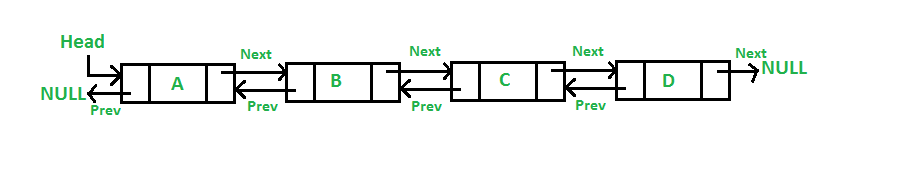

# Collection
##  Collection
 - `Collection` là `framework` cung cấp kiến trúc để lưu và thao tác với `elements` (`objects`) .
 - `Java Collection` cung cấp rất nhiều `interface`  (`Set`, `List`, `Queue`, `Deque`) và `classes` (`ArrayList`,`Vector`, `LinkedList`, `PriorityQueue`, `HashSet`, `LinkedHashSet`, `TreeSet`)
 - Một `Collection` là một `object` chứa các `object`.

## Hierarchy of Collection Framework

- `Package java.util` chứa tất cả các `class` và `interface` của `Collection Framework`.

 <p align = "center">
    
</p>

### `Iterable interface`
- `Iterable interface` là `interface` gốc của tất cả các `Collection` `class`. `Iterable interface` chứa duy nhất một `abstract method`:
```java
    Iterator<T> iterator()
```
- `Method` này trả về một `Iterator` của `type` T.

#### `Iterator interface`
- `Iterator interface` cung cấp khả năng lặp qua tất cả các `elements` theo thứ tự tăng dần.
- `Iterator interface` bao gồm các `method`:
```java
public boolean hasNext() // trả lại true nếu Iterator còn element chưa lặp qua

public Object next() // trả lại element hiện tại và di chuyển pointer đến element kế tiếp 

public void remove() // loại bỏ phần element của iterator
```

### `Collection Interface`
 - `Collection Interface` là `interface` mà sẽ được tất cả các `class` của `Collection Framework` triển khai. 
 - `Collection Interface` bao gồm các `method` dùng để thao tác với các `element` của `Collection`:
```java
abstract  boolean add(E e) ; // thêm element e vào Collection

abstract  boolean addAll(Collection<? extends E> c) ;// thêm nhiều element e vào Collection

abstract  boolean  clear(); // loại bỏ toàn bộ element e trong Collection

abstract  boolean  contains(Object o); // kiểm tra Object o có xuất hiện trong Collection không

abstract  boolean  containsAll(Collection<?> c)// kiểm tra các element trong Collection c có trong Collection không

abstract  boolean  isEmpty()// kiểm tra xem Collection có rỗng không

abstract  boolean  remove (Object o) // loại bỏ 1 Object được chỉ định trong Collection

abstract  boolean  removeAll(Collection<?> c)// loại bỏ các element trong Collection theo các element trong Collection c

abstract  boolean  retainAll(Collection<?> c) // loại bỏ các element trong Collection giữ lại  element trong Collection c

abstract  int      size() // trả lại size của Collection

abstract  int      iterator() // trả lại iterator của Collection
```
https://docs.oracle.com/javase/8/docs/api/java/util/Collection.html
### `List Interface`
- `List Interface` là `Collection` có thể lưu các `element` trùng lặp. `List Interface` được triển khai bởi các `class` ArrayList, LinkedList, Vector, and Stack.
```java
List <data-type> list1= new ArrayList();  
List <data-type> list2 = new LinkedList();  
List <data-type> list3 = new Vector();  
List <data-type> list4 = new Stack();  
```
- `List Interface` cung cấp các `method` để thao tác với các `element` trong `collection`.
- Ngoài các method đã nêu trên `Collection Interface`, `List Interface` bổ sung thêm các `method` đa dụng khác, xem tại đây:
  https://docs.oracle.com/javase/8/docs/api/java/util/List.html

#### `ArrayList`
- `ArrayList` là 1 trong những `class` triển khai của `List Interface`. `ArrayList` sử dụng 1 mảng động (`dynamic array`) để lưu `elements` và có thể lưu element trùng lặp.
 <p align = "center">
    
</p>

https://www.geeksforgeeks.org/how-do-dynamic-arrays-work/

- `ArrayList` là  `non-synchronized` và `non-Thread-safe` không an toàn về `thread`, một `object` `ArrayList` có thể truy cập bởi nhiều `thread`.
- `ArrayList` phù hợp để lưu và truy cập `elements`.
```java
import java.util.*;  
class TestJavaCollection1{  
public static void main(String args[]){  
ArrayList<String> list=new ArrayList<String>();//Creating arraylist  
list.add("Ravi");//Adding object in arraylist  
list.add("Vijay");  
list.add("Ravi");  
list.add("Ajay");  
//Traversing list through Iterator  
Iterator itr=list.iterator();  
while(itr.hasNext()){  
System.out.println(itr.next());  
}  
}  
}  
```
https://docs.oracle.com/javase/8/docs/api/java/util/ArrayList.html

#### `LinkedList`
- `LinkedList` là 1 trong những `class` triển khai của `List Interface`. `LinkedList` sử dụng `doubly linked list` để lưu `elements` và có thể lưu element trùng lặp.
 <p align = "center">
    
</p>

- `LinkedList` là  `non-synchronized` và `non-Thread-safe` không an toàn về `thread`, một `object` `LinkedList` có thể truy cập bởi nhiều `thread`.
-  `LinkedList` phù hợp để thực hiện các thay đổi trên `elements`. So với `ArrayList`, `LinkedList` chiếm nhiều bộ nhớ hơn và tốn `cache` hơn.
   https://stackoverflow.com/questions/12065774/why-does-cache-locality-matter-for-array-performance

```java
import java.util.*;  
public class TestJavaCollection2{  
public static void main(String args[]){  
LinkedList<String> al=new LinkedList<String>();  
al.add("Ravi");  
al.add("Vijay");  
al.add("Ravi");  
al.add("Ajay");  
Iterator<String> itr=al.iterator();  
while(itr.hasNext()){  
System.out.println(itr.next());  
}  
}  
}  
```
https://docs.oracle.com/javase/8/docs/api/java/util/LinkedList.html
