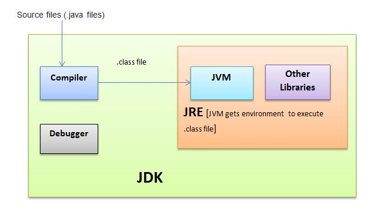
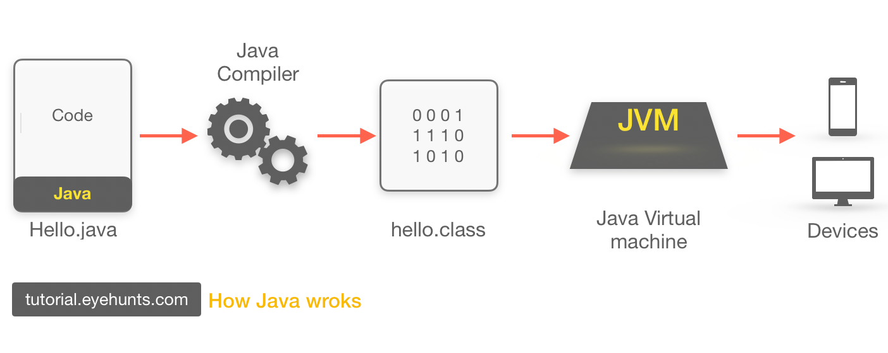
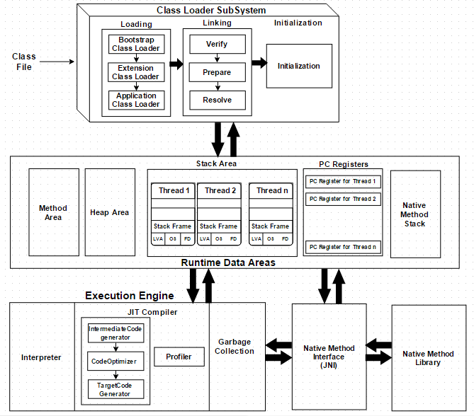
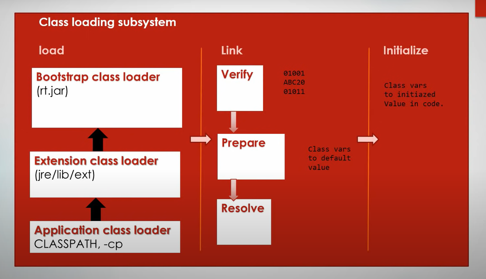
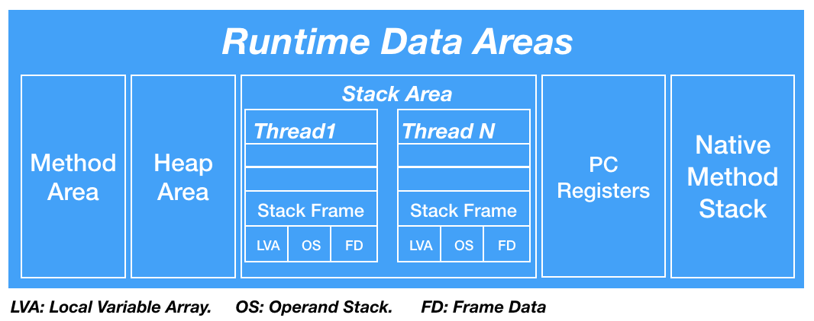
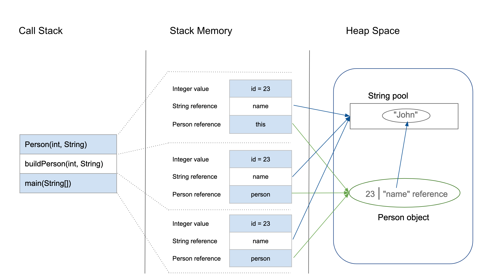

# JVM

## JDK
- Cấu trúc của JDK
<p align = "center">
    
</p>

## Java program execution flow

<p align = "center">
    
</p>

- `Source Code`: một phần mềm, ứng dụng được viết với đuôi .java

``` java
public class Hello {
public static void main(String[] args) {

        String str = "Hello World";
        System.out.println(str);
    }
}
```
- `Compiler`: phần mềm biên dịch, dịch source code của chúng ta ra `bytecode`.
- `JVM`: Đọc và chạy `bytecode`.

## `JVM` là gì?
- `JVM` (`Java Virtual Machine`): là trình thông dịch (`interpreter`) của Java được dùng để thực thi các chương trình Java.`JVM` cung cấp môi trường để code java có thể được thực thi.
Chương trình Java khi biên dịch sẽ tạo ra các mã máy gọi là `bytecodes`.
- `JVM` có những ưu điểm sau:
  - Dịch mã java ra mã máy chạy được trên các hệ điều hành khác nhau
  - Tăng tốc độ
  - Nâng cao độ bảo mật và tránh `virus` phá `source code`

## `JVM` Architecture
- `JVM` bao gồm 3 thành phần chính:
  - `Class Loader`: Tìm kiếm và load các file *.class vào `Runtime Memory/Data Area` dưới dạng bytecode.
  - `Runtime Memory/Data Area` : vùng nhớ hệ thống cấp phát cho `JVM`.
  - `Execution Engine`: chuyển các lệnh của `JVM` trong file *.class thành các lệnh của máy, hệ điều hành tương ứng và thực thi chúng.
  
 <p align = "center">
    
</p>

### `Class Loader`
- `Class Loader` hệ thống con của `JVM` thực hiện 3 nhiệm vụ theo thứ tự:
  - `Load`: bước này sẽ load các file file *.class theo thứ tự ưu tiên sau:
     - `Bootstrap ClassLoader`: `Class Loader` đầu tiên thực hiện loads các rt.jar (runtime jar) bao gồm tất cả các `class` của Java Standard Edition như java.lang package classes, java.net package classes, java.util package classes, java.io package classes, java.sql package classes etc.
     - `Extension ClassLoader`: `Class Loader` con của  `Bootstrap ClassLoader`. Load các .jar file được đặt trong thư mục $JAVA_HOME/jre/lib/ext.
     - `Application ClassLoader`: `Class Loader` con của  `Extension ClassLoader`. Load các *.class qua `CLASSPATH` (`CLASSPATH` là biến môi trường cho phép Java Runtime Environment (JRE) tìm kiếm các classes files và những tài nguyên khác như jar, zip files để chạy chương trình.). CLASSPATH được set mặc định là thư mục hiện tại nhưng có thể thay đổi bằng lệnh '-cp'
  - `Link`: Thực hiện các tác vụ verification, preparation, resolution.
     - `Verification`: kiểm tra xem file *.class đã đúng chưa, có thể `compile` được chưa, nếu chưa được thì bắn ra `run-time exception`.
     - `Preparation`: phân bổ bộ nhớ cho `static variables` của `class` và khởi tạo bộ nhớ cho `defaule value`.
     - `Resolution`: thay thế các `symbolic references` bằng `direct reference`. 
  - `Initialization`: Tất cả các `static variables` sẽ được gán giá trị gốc, các `static method` sẽ được thực thi.

 <p align = "center">
    
</p>

### `Runtime Data Area`
 <p align = "center">
    
</p>

- `Runtime Data Area` là nơi lưu trữ và phân chia dữ liệu của JVM bao gồm:

#### `Method Area`
-  Chứa tất cả các dữ liệu ở tầng `class` bao gồm `static variables`. `JVM` chỉ có duy nhất 1 `Method Area`, tất cả các `thread` sẽ dùng chung 1 `Method Area`.

#### `Heap Area`
- Chứa tất cả các `Object`. `JVM` chỉ có duy nhất 1 `Heap Area`, tất cả các `thread` sẽ dùng chung 1 `Heap Area`.

#### `Stack Area`
- Với mỗi `thread` sẽ có 1 `stack area` riêng. Mỗi `stack` bao gồm các `stack frame`. `Stack frame` được chia thành 3 loại:
   -  `Local Variable Array`: chứa các `local variables` của `method`.
   -  `Operand stack`: chứa các lệnh.
   -  `Frame data`: chứa các `method`.
  
 ```java
class Person {
    int id;
    String name;

    public Person(int id, String name) {
        this.id = id;
        this.name = name;
    }
}

public class PersonBuilder {
    private static Person buildPerson(int id, String name) {
        return new Person(id, name);
    }

    public static void main(String[] args) {
        int id = 23;
        String name = "John";
        Person person = null;
        person = buildPerson(id, name);
    }
}

```

 <p align = "center">
    
</p>
   
#### `PC Register`
- Mỗi `thread` sẽ có 1 `PC Register`. Mỗi `PC Register` sẽ lưu địa chỉ của tác vụ`JVM` đang thực thi.

#### `Native Method stacks`
- Mỗi `thread` sẽ có 1 `Native Method stacks` riêng. `Native Method stacks` chứa thông tin của `Native Method`.

### `Execution Engine`
- Đọc `bytecode` và thực thi từng phần theo thứ tự.
- `Execution Engine` bao gồm:
  - `Interpreter`: đọc và thực thi các `bytecode` theo từng dòng.
  - `JIT Compiler`: khi `Execution Engine` tìm thấy các đoạn code thực thi nhiều lần (vòng loop, for) sẽ đọc và chuyển toàn bộ đoạn code đó thành `native code` và gọi trực tiếp luôn mà ko cần biên dịch nữa. `JIT Compiler` bao gồm:
    - `Intermediate Code Generator`: Tạo code trung gian (`intermediate code`) để "nối" `native code` với `bytecode` đang được đọc.
    - `Code Optimizer`: tối ưu code `intermediate code`.
    - `Target Code Generator`: chuyển `intermediate code` thành `native machine code`.
  - `Garbage Collector`: xóa các object không được tham chiếu trong bộ nhớ.
