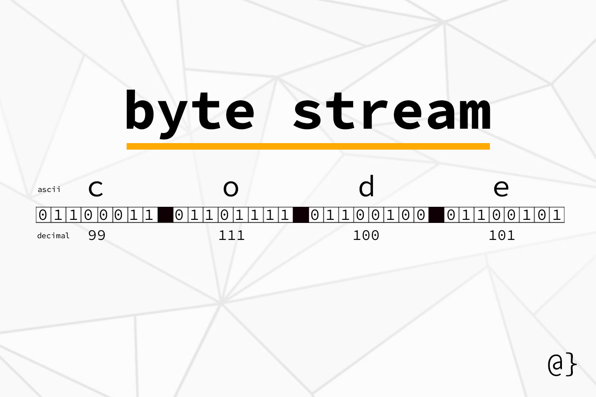
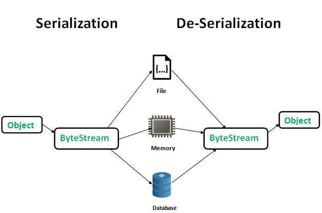
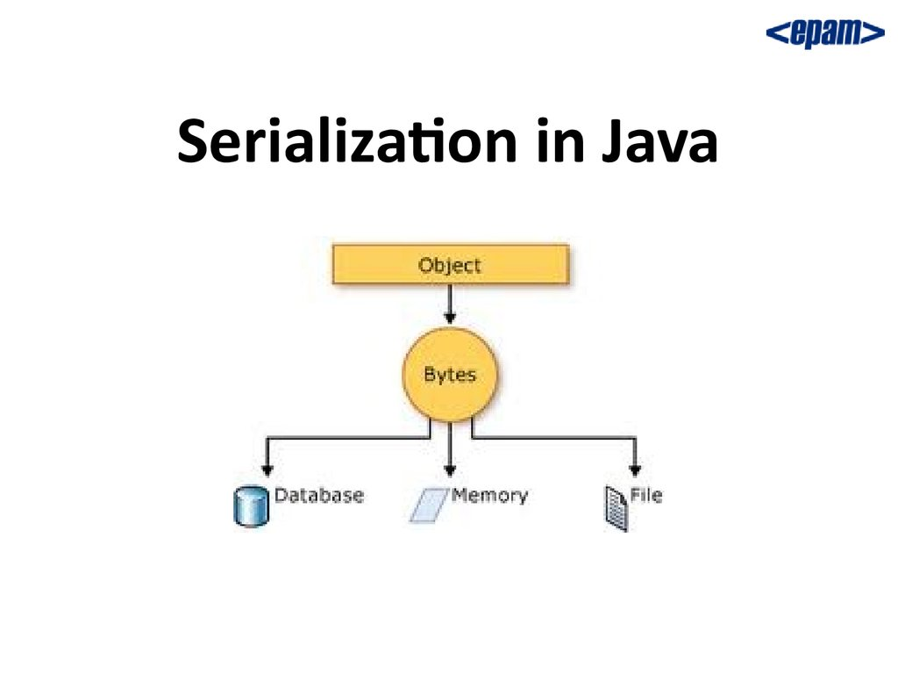
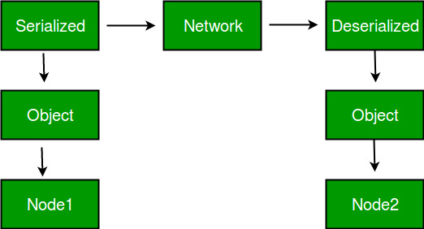
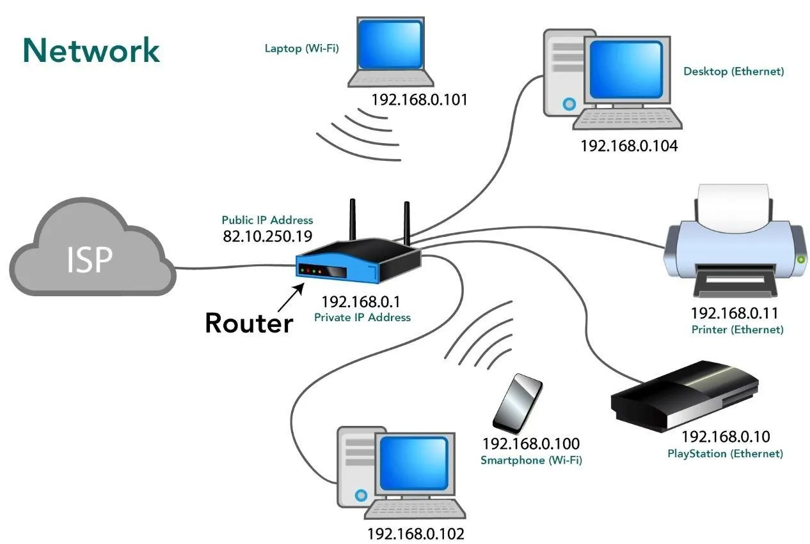

# Serialization
## `Byte stream`
- `Byte stream` là một dãy các `bytes` được sử dụng trong các phần mềm để nhập và xuất thông tin.
<p align = "center">
    
</p>

## `Serialization`
- `Serialization` là cơ chế chuyển đổi một `object` thành `byte stream`.
- `Deserialization`  là cơ chế chuyển đổi một `byte stream` thành `object`.
- `Byte stream` độc lập về nền tảng, một `Byte stream` của ứng dụng này có thể được sử dụng ở ứng dụng khác.

<p align = "center">
    
</p>

- Để `serialize` một `java` `object` ta cho `object` đó triển khai `java.io.Serializable` `interface`.
- Sử dụng `SerialVersionUID` để đánh dấu phiên bản của `object` qua đó, quá trình `Deserialization` có thể trả lại đúng phiên bản của `object`.
- `Code` mẫu triển khai `Serializable interface` lên `class` Student
```java
package com.huongdanjava.javaexample;
import java.io.Serializable;
public class Student implements Serializable {
private static final long serialVersionUID = 1L;// giữ nguyên 1 object trước và sau khi chuyển đổi. 
private String name;
    private int age;
    public String getName() {
        return name;
    }
    public void setName(String name) {
        this.name = name;
    }
    public int getAge() {
        return age;
    }
    public void setAge(int age) {
        this.age = age;
    }
}
```
```java
package com.huongdanjava.javaexample;
import java.io.FileOutputStream;
import java.io.IOException;
import java.io.ObjectOutputStream;
public class SerializationExample {
    public static void main(String[] args) {
        // Tạo student object
        Student student = new Student();
        student.setName(“Khanh”);
        student.setAge(30);
        // Lưu student vào file E:\\student.txt
        try ( FileOutputStream fos = new FileOutputStream(“E:\\student.txt”);
              ObjectOutputStream oos = new ObjectOutputStream(fos); ) {
            oos.writeObject(student);
        } catch (IOException i) {
            i.printStackTrace();
        }
    }
}
```
- Nội dung `file` E:\\student.txt
```text
’ sr &com.huongdanjava.javaexample.Student        I ageL namet Ljava/lang/String;xp   t Khanh
```
- Sau đó ta có thể đọc `Byte stream` đã lưu trong `student.txt` và chuyển đổi thành `object`.
```java
package com.huongdanjava.javaexample;
import java.io.FileInputStream;
import java.io.IOException;
import java.io.ObjectInputStream;
public class DeserializationExample {
public static void main(String[] args) {
Student student = null;
try ( FileInputStream fos = new FileInputStream(“E:\\student.txt”);
  ObjectInputStream oos = new ObjectInputStream(fos); ) {
student = (Student) oos.readObject();
} catch (IOException i) {
i.printStackTrace();
} catch (ClassNotFoundException e) {
e.printStackTrace();
}
System.err.println(student.getName());
System.err.println(student.getAge());
}
}
```
```shell
Khanh
30
```
### Một số lưu ý về `Serializable interface`
- `Serializable interface` là một `marker interface` (`interface` không có `attribute` hay `method`). `Marker interface` dùng để đánh dấu 1 `class` có khả năng để làm gì đó, trong trường hợp này là `Serializable`.
- Các dữ liệu `static` và `transient` sẽ không được chuyển đổi thành `byte stream`.
- Các `object` liên quan cũng phải triển khai `Serializable interface`.
### Lợi ích của cơ chế `Serialization`
#### - Lưu lại trạng thái thông tin của một `object`
<p align = "center">
    
</p>

#### - Chuyền `object` qua `Network`.
<p align = "center">
    
</p>

- `Network` là một tập hợp các máy tính, server, mainframe, thiết bị mạng, thiết bị ngoại vi hoặc các thiết bị khác được kết nối để cho phép chia sẻ dữ liệu, trao đổi tệp và giao tiếp với nhau. 

<p align = "center">
    
</p>
