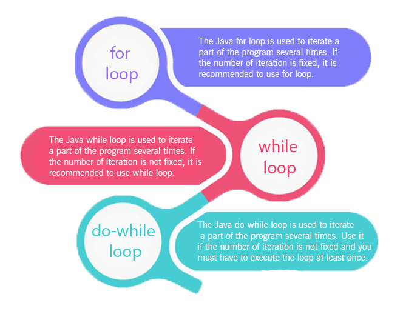
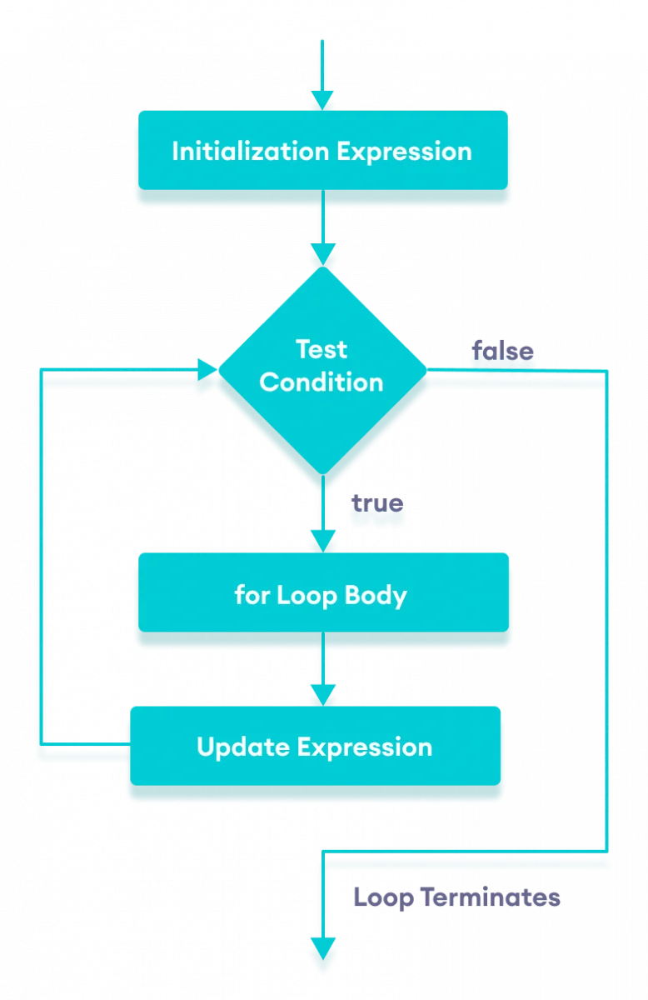
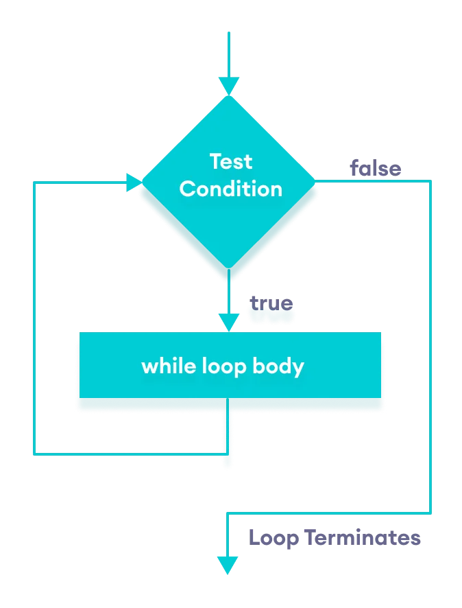
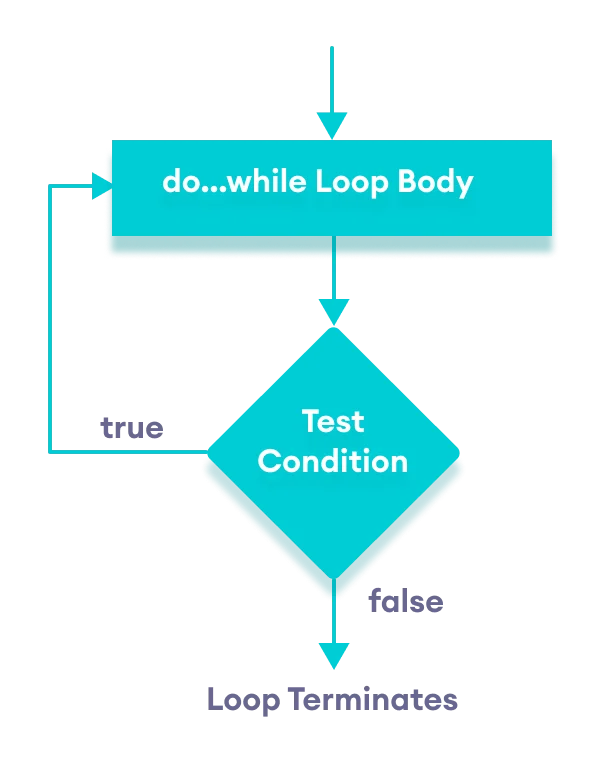

# Loops
- Trong lập trình, vòng lặp được sử dụng để lặp lại một`block code.`Ví dụ: nếu muốn
hiển thị một thông báo 100 lần, thì thay vì nhập cùng một mã 100 lần, ta có thể sử 
dụng vòng lặp.
- Trong Java, có 3 kiểu loops:

<p align = "center">
    
</p>

## `for Loop`
- một vòng lặp `for loop` cơ bản có 4 phần:
```
for (initialExpression; condition; updateExpression) {
    // body of the loop
}
```
1. `initialExpression:`khởi tạo và/hoặc khai báo các biến.
2. `condition:`điều kiện sẽ được`check`để chạy vòng lặp. Nếu`condition = true`-->phần
`body`sẽ được execute, ngược lại nếu`condition = false`--> vòng lặp ko chạy
3. `updateExpression:`cập nhật giá trị của `initialExpression.`-->`condition`sẽ được
`check`lại
4. `body`: là`block code`của vòng lặp.`block code`này sẽ chạy lặp đi lặp lại cho đến 
khi nào `condition = false` --> vòng lặp chấm dứt

<p align = "center">
    
</p>

```java
public class Example {
  public static void main(String[] args) {
      int n = 5;
      // for loop  
      for (int i = 1; i <= n; ++i) {
          System.out.println("Java is not fun");
      }
  }
}
```
```shell
Java is not fun
Java is not fun
Java is not fun
Java is not fun
Java is not fun
```
### `for-each Loop`
- Vòng`for loop`của Java có một kiểu syntax khác để giúp dễ dàng lặp qua các`arrays` 
và `collection`.
```java
public class Example{
    public static void main(String[] args) {
        // create an array
        int[] numbers = {0, 4, 1, 1};

        // iterating through the array 
        for (int number: numbers) {
            System.out.println(number);
        }
    }
}
```
```shell
0
4
1
1
```

## `while Loop`
```
while (condition) {
    // body of loop
}
```
1. `while loop`sẽ check`condition.` 
2. `condtion = true:` --> `body` sẽ được executed
3. `condtion` sẽ được check lại
4. Lặp lại process
5. `condition = false` --> vòng lặp dừng chạy

<p align = "center">
    
</p>

```java
public class Example {
  public static void main(String[] args) {
      int i = 1, n = 5;
      // while loop from 1 to 5
      while (i <= n) {
          System.out.println(i);
          i++;
      }
  }
}
```
```shell
1
2
3
4
5
```

## `do...while Loop`
- sự khác nhau giữa`do...while Loop`với các vòng lặp khác là phần body sẽ được chạy 
trước khi `condition` được check
```
do {
    // body of loop
} while(condition);
```
1. `body` sẽ được executed, sau đó thì `condition` sẽ được check
2. `condtion = true:` --> `body` sẽ được executed lại
3. `condition` sẽ lại được check lần nữa
4. Lặp lại process
5. `condition = false` --> vòng lặp dừng chạy

<p align = "center">
    
</p>

```java
public class Example {
  public static void main(String[] args) {
      int i = 0, n = 5;

      // do...while loop from 1 to 5
      do {
          i++;
          System.out.println(i);
      } while (i <= n);
  }
}
```
```shell
1
2
3
4
5
6
```