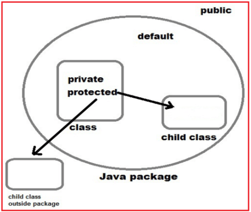

# `Encapsulation`
## Definition
- `Encapsulation` (tính đóng gói): đóng gói dữ liệu, logic trong 1 khối hoặc đơn vị nhất định. `Encapsulation`giúp dữ liệu, code không bị truy cập bừa bãi từ bên ngoài.

```java
/* File name : EncapTest.java */
public class EncapTest {
   private String name;
   private String idNum;
   private int age;

   public int getAge() {
      return age;
   }

   public String getName() {
      return name;
   }

   public String getIdNum() {
      return idNum;
   }

   public void setAge( int newAge) {
      age = newAge;
   }

   public void setName(String newName) {
      name = newName;
   }

   public void setIdNum( String newId) {
      idNum = newId;
   }
}
```

## `Access modifier`
- `Access modifier` giúp xác định quyền truy cập của các đơn vị khác tới 1 đơn vị.
- Trong Java có 4 loại `Access modifier`:
  - Private: Chỉ truy cập trong phạm vi `class`
  - Default: Chỉ truy cập trong phạm vi `package`
  - Protected:  Chỉ truy cập trong phạm vi `package` + `sub-class`
  - Public: Truy cập từ tất cả mọi nơi

<p align = "center">
    
</p>


