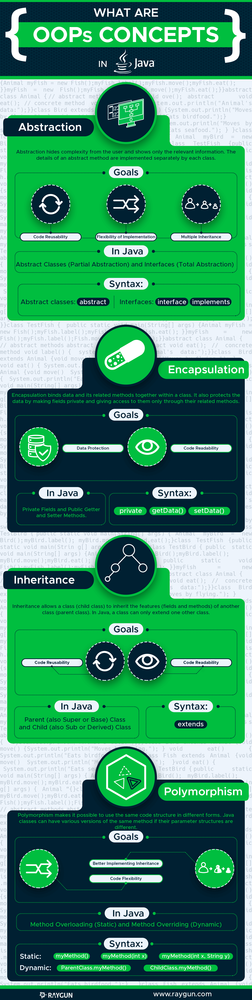

# Object-Oriented Programming
## `OOP`
- Lập trình hướng đối tượng (OOP) là một kỹ thuật lập trình xoay quanh việc tạo, thiết kế và tương tác giữa các `object`.
- OOP được xây dựng dựa trên khái niệm về `class` và `object`. Một ứng dụng lập trình sẽ được tổ chức và chia ra thành rất nhiều các bản thiết kế đơn giản và có thể tái sử dụng `class`.
Những `class` này sẽ được dùng để tạo lên các `object`. Những tính năng của ứng dụng sẽ đươc xây dựng dựa trên tương tác giữa các `object` này.
- Một ngôn ngữ `OOP` sẽ bao gồm 4 tính chất:
  - Abstraction
  - Encapsulation
  - Inheritance
  - Polymorphism
  

    

## Advantages of OOP
- Tăng khả năng tái sử dụng code
- Tăng năng suất phát triển phần mềm
- Dễ dàng fix bug
- Tăng khả năng bảo mật của phần mềm
- Dễ bảo trì sửa đồi
- Tránh lặp lại dữ liệu
- Thiết kế linh hoạt 
- Cung cấp khả năng thiết kế ứng dụng theo nhu cầu
- Giarm chi phí code

## Disadvantages of OOP
- Tốn nhiều thời gian để nắm bắt và áp dụng hiệu quả
- Chậm hơn các ứng dụng khác
- Mất nhiều thời gian hơn để giải quyết những vấn đề nhỏ
- Dung lượng của ứng dụng sẽ lớn hơn các ứng dụng khác

