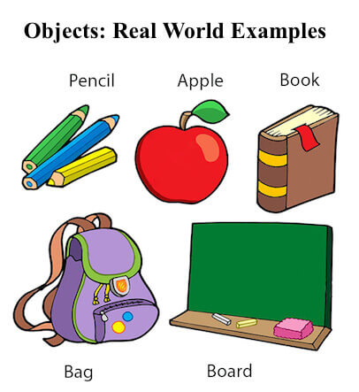

# Class và object

## Object
- Object là 1 thực thể có trạng thái (state) và hành vi (behavior)

    

- Một object sẽ có 3 đặc điểm:
  - State: đại diện cho dữ liệu hoặc giá trị của object.
  - Behavior: đại diện cho hành vi của object.
  - Identity: nhân dạng là 1 ID độc nhất mà chỉ object đó có. Gía trị của Id không thể được nhìn thấy bởi lập trình viên. JVM sẽ dùng ID của object để phân biệt với các object khác.

