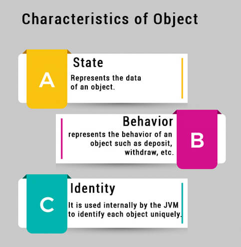
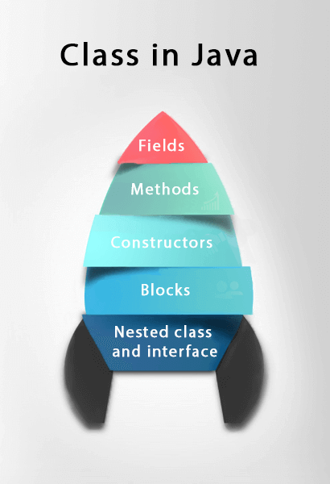

# Class và object

## `Object`
- `Object` là 1 thực thể có trạng thái (`state`) và hành vi (`behavior`). 
- `Object` là thể hiện của 1 `class`.
<p align = "center">
    
</p>

- Một `object` sẽ có 3 đặc điểm:
  - `State`: đại diện cho dữ liệu hoặc giá trị của `object`.
  - `Behavior`: đại diện cho hành vi của `object`.
  - `Identity`: nhân dạng là 1 ID độc nhất mà chỉ `object` đó có. Gía trị của Id không thể được nhìn thấy bởi lập trình viên. `JVM` sẽ dùng ID của `object` để phân biệt với các `object` khác.
  
<p align = "center">
    
</p>

## `Class`
- `Class` là 1 bản vẽ, bản thiết kế để tạo ra các object.
- Một `class` bao gồm: 
  - `Fields`
  - `Methods`
  - `Constructors`
  - `Blocks`
  - `Nested class and interface`
  
  <p align = "center">
    
</p>

- Cấu trúc để khai báo 1 `class`.

```java
class <class_name>{  
    field;  
    method;  
}  
```
## `new` keyword 
- Keyword new sẽ báo với JVM phân bổ bộ nhớ ở Heap space và tạo ra 1 object mới qua constructor.

## `Constructor`
- `Constructor` là 1 code block sẽ chạy khi ta khởi tạo `object`.
- `Constructor` chạy trước khi `object` được tham chiếu.
- Tất cả các Class đều có 1 `Constructor defaule` ngay cả khi chúng ta không viết ra.

```java
// Create a Main class
public class Main {
  int x;  // Create a class attribute

  // Create a class constructor for the Main class
  public Main() {
    x = 5;  // Set the initial value for the class attribute x
  }

  public static void main(String[] args) {
    Main myObj = new Main(); // Create an object of class Main (This will call the constructor)
    System.out.println(myObj.x); // Print the value of x
  }
}

// Outputs 5
```

## Ways to initialize object
- Khi khởi tạo 1 object nghĩa là chúng ta tạo và lưu dữ liệu vào `object` đó.
- Có 3 cách để khởi tạo `object`:
  - By `reference variable`
  - By `method`
  - By `constructor`

### Initialization steps

### Initialization through reference
- Khởi tạo qua `reference variable`.
- Sử dụng từ khóa `new` và gọi đến `constructor` của `object`.
```java
class Student{  
 int id;  
 String name;  
}  
class TestStudent2{  
 public static void main(String args[]){  
  Student s1=new Student();  
  s1.id=101;  
  s1.name="Sonoo";  
  System.out.println(s1.id+" "+s1.name);//printing members with a white space  
 }  
}
```

