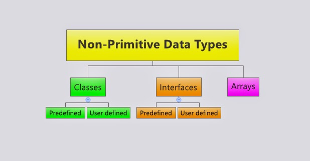
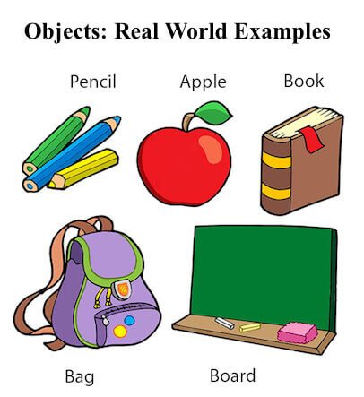

# GIỚI THIỆU NHỮNG CÚ PHÁP JAVA CƠ BẢN

<p align = "center">
    
</p>

## `Main method`
- Hàm khởi đầu để chạy 1 phần mềm java.

<p align = "center">
    
</p>

## `Variable`
- `variable` (biến) là 1 đơn vị lưu giữ các giá trị khi chương trình java được thực thi.

<p align = "center">
    
</p>

<p align = "center">
    
</p>

## `Data type`
- `Type` (kiểu dữ liệu) là 1 cách để phân loại `variable`.

<p align = "center">
    
</p>

### `Primative data type`
- `Primative data type` (kiểu dữ liệu nguyên thủy) là kiểu dữ liệu được định nghĩa trước bởi Java bao gồm: 

```java
Type	Size	Stores
byte	1 byte	whole numbers from -128 to 127
short	2 bytes	"" -32,768 to 32,767
int	4 bytes	"" -2,147,483,648 to 2,147,483,647
long	8 bytes	""-9,223,372,036,854,775,808 to 9,223,372,036,854,775,807
float	4 bytes	fractional numbers; for storing 6 to 7 decimal digits
double	8 bytes	fractional numbers; "" 15 ""
boolean	1 bit	true or false values
char	2 bytes	single character/letter or ASCII values

```
### `Non-Primitive data type`
- Những kiểu dữ liệu không phải `Primative data type` bao gồm: 
  - `Class`
  - `String`
  - `Array`
  - `Interface`

<p align = "center">
    
</p>

## `Array`
- `Array` (mảng) dùng để lưu trữ các dữ liệu có nhiều giá trị trong 1 `variable`.

```java
int[] anas = new int[3];
        age[0] = 1;
        age[1] = 3;
        age[2] = 6;
```
## `Object`
- Java là 1 ngôn ngữ `OOP` - hướng đối tượng (`object`) vậy nên hiểu được `object` trong java là rất quan trọng.
Vậy thì `object` là gì, `object` là tất cả những thứ tồn tại xung quanh cuộc sống của chúng ta và khi mang khái niệm này vào lập trình cũng như vậy. Trong java, `object` sẽ bao gồm `Attribute` (đặc điểm, tính chất) và `Method` (hành động)
Java sẽ cung cấp cho chúng ta những công cụ để tạo và điều khiển các `object` tương tác với nhau qua đó xây dựng nên 1 ứng dụng java.

<p align = "center">
    
</p>

## `Packages`
- `Packages` là nơi chứa các `Class` có liên quan đến nhau.

<p align = "center">
    
</p>

## `Class`
- `Class` chính là bản thiết kế để tạo nên các `object`. Chẳng hạn như `Class` Dog thì có thể sử dụng để tạo nên các thể loại `object` chó khác nhau. Mỗi chú chó sẽ là 1 `object` riêng biệt yourDog khác myDog, `class` là khuôn mẫu chung của Dog để tạo ra những chú chó khác nhau.
Các đặc điểm và hành động của 1 `object` dog sẽ được thể hiện qua `Attributes` và `Methods`.

<p align = "center">
    
</p>

```java
public class Dog {
  private double weight;
  private double height;
  public void run(){
      System.out.println("Hey human am running :D");
  }
}
```
## `Attribute`
- `Attribute` là variable thuộc về object.

<p align = "center">
    
</p>


## `Method`
- `Method` (`functions`) là một khối code thực hiện những tác vụ cụ thể và sẽ chỉ thực thi khi được gọi, chúng ta có thể chuyền `data` vào trong `method`, những `data` này được gọi là `parameters`.

<p align = "center">
    
</p>


## `Keywords`
- Những từ đã có ý nghĩa riêng nhất định trong java và không được đem ra làm tên riêng cho `variable`, `method`, `class` ...

<p align = "center">
    
</p>

