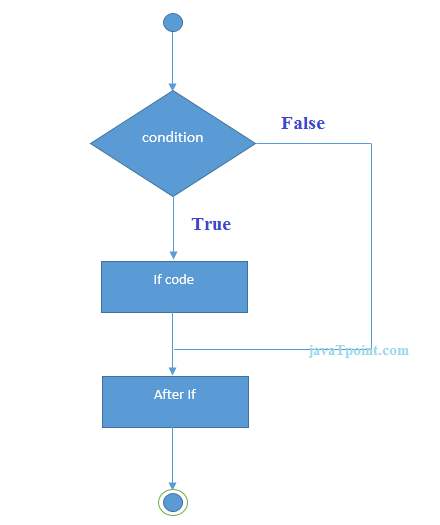
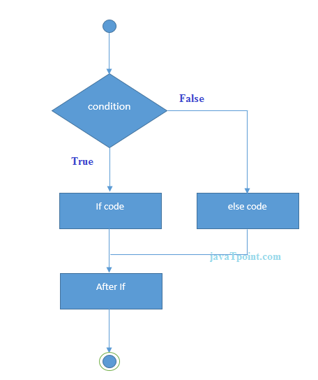
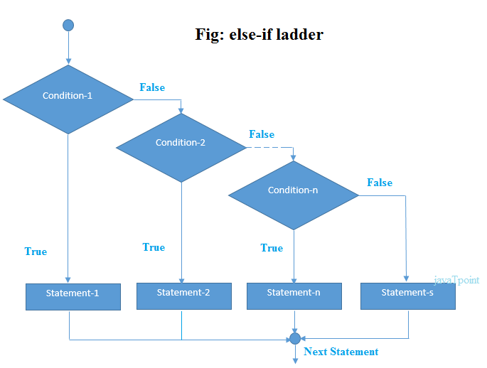
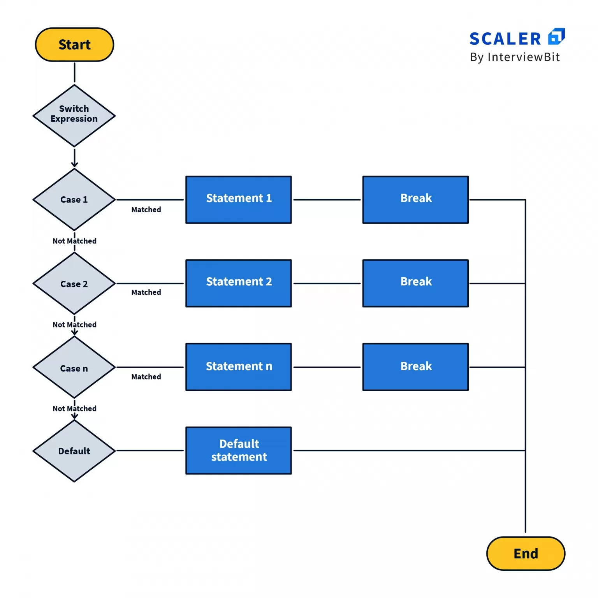

# Conditionals

- `Conditional statements`, `expressions` hay đơn giản là `conditionals` là các 
tính năng của ngôn ngữ lập trình yêu cầu máy tính thực hiện một số hành động nhất 
định khi các điều kiện nhất định được đáp ứng.

```java
public class LocalVariableTest {
   public static void main(String [] args) {
      int a = 1;
      int b = 2;
      if(a>b) {
          System.out.println("a is bigger");
      } else {
          System.out.println("b is bigger");
      }
   }
}
```

```shell
b is bigger
```

## `if statement`
- `if statement` là điều kiện đầu tiên được sử dụng để mở đầu cho các câu lệnh 
điều kiện

```java
public class Day {
    public String day;

    public Day(String newDay) {
        day = newDay;
    }

    public void whatToDo() {
        if (day == "Monday") { // Condition
            // Decision
            System.out.println("Go to School");
        }
    }

    public static void main(String[] args) {
        Day monday = new Day("Monday");
        monday.whatToDo();
    }
}
```

```shell
Go to School
```

- Biểu thức `if` chỉ đơn giản là so sánh xem điều kiện (hoặc các điều kiện) được 
đặt trong dấu `()` là `true` hay `false`
- Nếu điều kiện là `true` nó sẽ thực thi các dòng code trong `if block`
- Nếu điều kiền là `false` nó sẽ bỏ qua `if block` và chạy tiếp các dòng code dưới

<p align = "center">
    
</p>

## `else statement`
- Khi mà `if` hay tất cả `else if` đều trả về là false thì `else block` sẽ được executes

```java
public class Weather {
    public String weather;

    public Weather(String todayWeather) {
        weather = todayWeather;
    }

    public void whatToDo() {
        // 1st condition
        if (weather == "Sunny") {
            // Decision
            System.out.println("Read in the Library");
        } else {
            // Default Decision
            System.out.println("Get some Sleep");
        }
    }

    public static void main(String[] args) {
        Weather sunny = new Weather("Sunny");
        Weather storm = new Weather("Storm");
        sunny.whatToDo();
        storm.whatToDo();
    }
}
```

```shell
Read in the Library
Get some Sleep
```

<p align = "center">
    
</p>

## `else if statement`
- `else if` được dùng để check nhiều điều kiện cùng 1 lúc.

```java
public class Weather {
    public String weather;

    public Weather(String todayWeather) {
        weather = todayWeather;
    }

    public void whatToDo() {
        // 1st condition
        if (weather == " Sunny") {
            // Decision
            System.out.println("Read in the Library");
        }
        // 2nd condition
        else if (weather == "Raining") {
            //decision
            System.out.println("Read at Home");
        }
        // 3rd condition
        else if (weather == "Cloudy") {
            // Decision
            System.out.println("Read in the Garden");
        } else {
            // Default Decision
            System.out.println("Get some Sleep");
        }
    }

    public static void main(String[] args) {
        Weather sunny = new Weather("Sunny");
        Weather raining = new Weather("Raining");
        Weather cloudy = new Weather("Cloudy");
        Weather storm = new Weather("Storm");
        sunny.whatToDo();
        raining.whatToDo();
        cloudy.whatToDo();
        storm.whatToDo();
    }
}
```

```shell
Read in the Library
Read at Home
Read in the Garden
Get some Sleep
```

<p align = "center">
    
</p>

## `Nested if statement`
- là các `if block` bên trong 1 `if block` khác. Điều kiện để `inner` if block 
được thực thi là khi điều kiện của `outer` if block là `true`.

```java
public class Weather {
    public String weather;
    private String friend;

    public Weather(String todayWeather) {
        weather = todayWeather;
    }

    public void setFriend(String myFriend) {
        friend = myFriend;
    }

    public void whatToDo() {
        // 1st condition
        if (weather == "Sunny") {
            if (friend == "Dai") {
                // Decision
                System.out.println("Đi nét");
            } else {
                System.out.println("Read in the Library");
            }
        } else {
            // Default Decision
            System.out.println("Get some Sleep");
        }
    }

    public static void main(String[] args) {
        Weather sunny = new Weather("Sunny");
        Weather storm = new Weather("Storm");
        sunny.setFriend("Dai");
        sunny.whatToDo();
        storm.whatToDo();
    }
}
```

```shell
Đi nét
Get some Sleep
```

<p align = "center">
    
</p>

## `Switch`
- `Switch` là một phiên bản khác của câu lệnh `if`. Nó làm cho code trông sạch hơn 
và dễ đọc hơn so với các câu lệnh điều kiện `if`, `else if` và `else`
- Trong `switch expression`, mỗi block được kết thúc bằng một từ khóa `break`. Các 
câu lệnh trong `switch` được expressed với `cases`.

```java
public class Day {
    public int day;

    public Day(int date) {
        day = date;
    }

    public void whatToDo() {
        switch (day) {
            case 1:
                Console.WriteLine("Read in the Library");
                break;
            case 2:
                Console.WriteLine("Read at Home");
                break;
            case 3:
                Console.WriteLine("Read in the Garden");
                break;
            default:
                Console.WriteLine("Get some Sleep");
                break;
        }
    }

    public static void main(String[] args) {
        Day day1 = new Day(3);
        day1.whatToDo();
    }
}
```

```shell
Read in the Garden
```

<p align = "center">
    
</p>