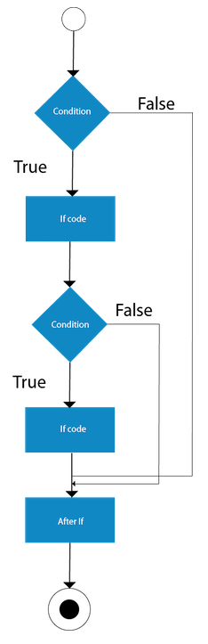

# Conditionals

- `Conditional statements`, `expressions` hay đơn giản là `conditionals` là các 
tính năng của ngôn ngữ lập trình yêu cầu máy tính thực hiện một số hành động nhất 
định khi các điều kiện nhất định được đáp ứng.

```java
public class LocalVariableTest {
   public static void main(String [] args) {
      int a = 1;
      int b = 2;
      if(a>b) {
          System.out.println("a is bigger");
      } else {
          System.out.println("b is bigger");
      }
   }/// print b is bigger
}
```

## `if statement` 
- `if statement` là điều kiện đầu tiên được sử dụng để mở đầu cho các câu lệnh 
điều kiện sau

```java
public class IfExample {
    public class Day {
        public String day;

        public Day(String newDay) {
            day = newDay;
        }

        public void whatToDo() {
            if (day == "Monday") { // Condition
                // Decision
                System.out.println("Go to School");
            }
        }
    }
    public static void main(String[] args) {
        Day monday = new Day("Monday");
        monday.whatToDo();/// print "Go to School"
    }
}
```

- Biểu thức `if` chỉ đơn giản là so sánh xem điều kiện (hoặc các điều kiện) được 
đặt trong dấu `()` là `true` hay `false`
- Nếu điều kiện là `true` nó sẽ thực thi các dòng code trong `if block`
- Nếu điều kiền là `false` nó sẽ bỏ qua `if block` và chạy tiếp các dòng code dưới

<p align = "center">
    
</p>

## `else statement`
- Khi mà `if` hay tất cả `else if` đều trả về là false thì `else block` sẽ được executes

```java
public class IfElseExample {
    public class Weather {
        public String weather;

        public Weather(String todayWeather) {
            weather = todayWeather;
        }

        public void whatToDo() {
            // 1st condition
            if (weather == "Sunny") {
                // Decision
                System.out.println("Read in the Library");
            } else {
                // Default Decision
                System.out.println("Get some Sleep");
            }
        }
    }
    public static void main(String[] args) {
        Weather sunny = new Weather("Sunny");
        Weather storm = new Weather("Storm");
        sunny.whatToDo();/// print "Read in the Library"
        storm.whatToDo();/// print "Get some Sleep"
    }
}
```

<p align = "center">
    
</p>

## `else if statement`
- `else if` được dùng để check nhiều điều kiện cùng 1 lúc.

```java
public class IfElseIfExample {
    public class Weather {
        public String weather;

        public Weather(String todayWeather) {
            weather = todayWeather;
        }

        public void whatToDo() {
            // 1st condition
            if (weather == " Sunny") {
                // Decision
                System.out.println("Read in the Library");
            }
            // 2nd condition
            else if (weather == "Raining") {
                //decision
                System.out.println("Read at Home");
            }
            // 3rd condition
            else if (weather == "Cloudy") {
                // Decision
                System.out.println("Read in the Garden");
            } else {
                // Default Decision
                System.out.println("Get some Sleep");
            }
        }
    }
    public static void main(String[] args) {
        Weather sunny = new Weather("Sunny");
        Weather raining = new Weather("Raining");
        Weather cloudy = new Weather("Cloudy");
        Weather storm = new Weather("Storm");
        sunny.whatToDo();/// print "Read in the Library"
        raining.whatToDo();/// print "Read at Home"
        cloudy.whatToDo();/// print "Read in the Garden"
        storm.whatToDo();/// print "Get some Sleep"
    }
}
```

<p align = "center">
    
</p>

## `Nested if statement`
- là các `if block` bên trong 1 `if block` khác. Điều kiện để `inner` if block 
được thực thi là khi điều kiện của `outer` if block là `true`.

```java
public class NestedIfExample {
    public class Weather {
        public String weather;
        private String friend;
        
        public Weather(String todayWeather) {
            weather = todayWeather;
        }
        
        public void setFriend (String myFriend) {
            friend = myFriend;
        }
        
        public void whatToDo() {
            // 1st condition
            if (weather == "Sunny") {
                if (friend == "Dai") {
                    // Decision
                    System.out.println("Đi nét");
                } else {
                    System.out.println("Read in the Library");
                }
            } else {
                // Default Decision
                System.out.println("Get some Sleep");
            }
        }
    }
    public static void main(String[] args) {
        Weather sunny = new Weather("Sunny");
        Weather storm = new Weather("Storm");
        sunny.setFriend("Dai");
        sunny.whatToDo();/// print "Đi nét"
        storm.whatToDo();/// print "Get some Sleep"
    }
}
```

<p align = "center">
    
</p>