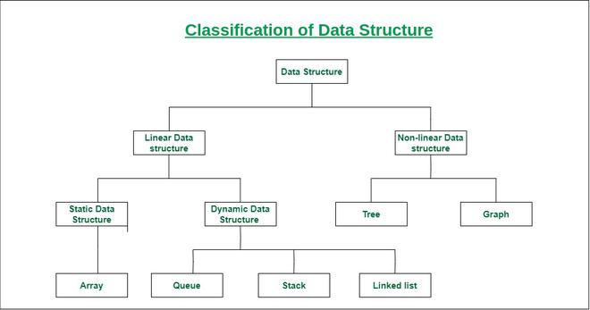

# Data Structure
- `Data Structure` là một cách để organize các dữ liệu trong `memory` để nó có thể xử 
lý, truy xuất hay lưu trữ đống dữ liệu đó 1 cách hiệu quả. Một số `Data Structures`phổ
biến: linked list, stack, hashtable, queue, tree, heap, và graph.

## `Two types of data structures`
- `Primitive data structure`: là các `primitive data types`. Các kiểu dữ liệu như là 
int, char, float, double, và pointer đều là `primitive data structures` có thể chứa một
giá trị
- `Non-Primitive Data structure`: có thể chia thành 2 loại nữa `Linear Data Structure`
và `Non-linear Data Structure`

    

- `Linear Data Structure`: là 1 cấu trúc dữ liệu mà trong đó các phần tử dữ liệu được 
sắp xếp tuần tự hoặc tuyến tính, trong đó mỗi phần tử được gắn với các phần tử liền 
kề trước nó và tiếp theo của nó.
  - `Static data structure`: Nó là một loại cấu trúc dữ liệu mà kích thước được chỉ 
  định tại thời điểm `compile`. Do đó, nó có kích thước bộ nhớ tối đa là cố định. -->
  Việc truy cập các phần tử trong `Static data structure` sẽ dễ dàng hơn.
  - `Dynamic data structure`: Nó là một kiểu cấu trúc dữ liệu mà kích thước được chỉ 
  định trong `run time`. Do đó, kích thước tối đa là `flexible`. Nó có thể được cập 
  nhật ngẫu nhiên trong `run time`, điều này có thể được coi là hiệu quả đến độ phức 
  tạp của bộ nhớ của code
- `Non-linear data structure`: là kiểu cấu trúc dữ liệu mà các phần tử dữ liệu không 
được đặt theo trình tự hoặc tuyến tính thì được gọi là `Non-linear data structure`. 
Trong `Non-linear data structure`, chúng ta không thể duyệt qua tất cả các phần tử 
chỉ trong một lần chạy.

### Learn More:
- có rất nhiều kiểu data structures khác, để đọc được kĩ hơn thì có thể lên 2 link này
  - https://www.geeksforgeeks.org/data-structures/
  - https://www.javatpoint.com/data-structure-tutorial