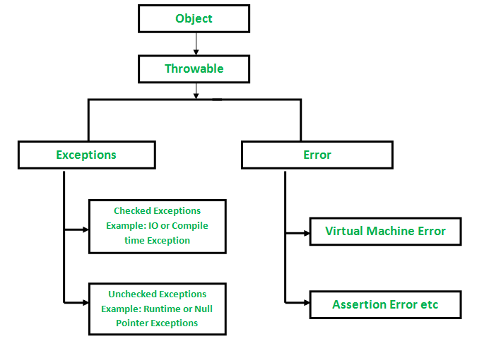
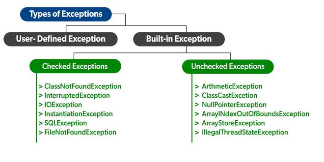
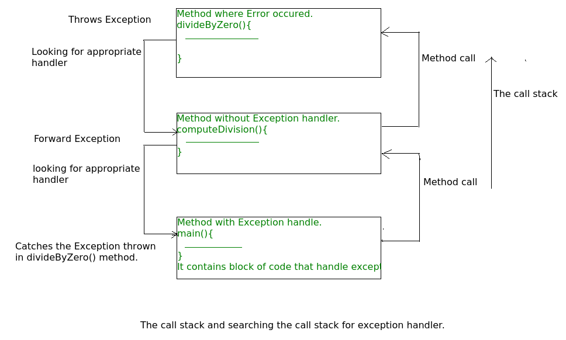

# Exception Handling
- `Exception`là một`unwanted`hay`unexpected event`, xảy ra trong quá trình program đang
được execute, tức là đang trong`run time,`làm gián đoạn`flow`của program.
- `Exception Handling`trong Java là một trong những cơ chế hiệu quả để xử lý các
`runtime errors`như`ClassNotFoundException`,`IOException`,`SQLException`,
`RemoteException`, v.v. để có thể duy trì `flow` thông thường của ứng dụng.

## `Exception Hierarchy`
- Tất cả các`Exception`và`Error`là các`subclass`của class`Throwable`, là`base class` 
của hệ thống phân cấp rồi rẽ đến hai nhánh do`Exception`và`Error`đứng đầu.
  - `Exception:`được sử dụng cho các`conditions`đặc biệt mà program của người dùng sẽ 
  `catch` được.
  - `Error:`được sử dụng bởi `Java run-time system(JVM)` để chỉ ra các lỗi phải thực 
  hiện với chính `Java run-time environment (JRE)`.

<p align = "center">
    
</p>

## `Types of Exceptions`
<p align = "center">
    
</p>

1. `Built-in Exceptions:`là những`exceptions`có sẵn trong các thư viện Java. Các 
`exceptions` này phù hợp để giải thích các tình huống `error` nhất định
   1. `Checked Exception:`hay còn được gọi là`compile-time exceptions`vì các`exception`
   này được`compiler`kiểm tra tại thời điểm `compile`.
   2. `Unchecked Exception:`đối lập với các`checked exception`. Trình`compiler`sẽ 
   không kiểm tra các`exception`này tại thời điểm `compile`. Nói một cách đơn giản, 
   nếu một chương trình đưa ra một`exception`không được kiểm tra và ngay cả khi ta 
   không xử lý hoặc khai báo nó, chương trình sẽ không báo lỗi `compilation error`.
2. `User-Defined Exceptions:`
    - Đôi khi, các`built-in exception`trong Java không thể mô tả một tình huống nhất 
   định. Trong những trường hợp như vậy, người dùng cũng có thể tạo`exceptions`, được 
   gọi là `user-defined Exceptions`. 

## Các Method Để Lấy Exception Informations
1. printStackTrace(): in ra`exception information`theo format`Name of the exception: 
description of the exception, stack`

    ```java
    import java.io.*;
    class Example {
        public static void main (String[] args) {
          int a=5;
          int b=0;
            try{
              System.out.println(a/b);
            }
          catch(ArithmeticException e){
            e.printStackTrace();
          }
        }
    }
    ```
    ```shell
    java.lang.ArithmeticException: / by zero
    at Example.main(File.java:10)
    ```

2. toString(): in ra`exception information`theo format`Name of the exception: 
description of the exception`

    ```java
    import java.io.*;
    class Example {
        public static void main (String[] args) {
            int a=5;
            int b=0;
            try{
                System.out.println(a/b);
            }
            catch(ArithmeticException e){
                System.out.println(e.toString());
            }
        }
    }
    ```
    ```shell
    java.lang.ArithmeticException: / by zero
    ```
3. getMessage(): method này chỉ in ra mỗi `description of the exception`.
    ```java
    import java.io.*;
    class Example {
        public static void main (String[] args) {
            int a=5;
            int b=0;
            try{
                System.out.println(a/b);
            }
            catch(ArithmeticException e){
                System.out.println(e.getMessage());
            }
        }
    }
    ```
    ```shell
    / by zero
    ```
   
## How Does JVM handle an Exception?
- `Default Exception Handling:`Bất cứ khi nào bên trong một `method`, nếu có một 
`exception` xảy ra,`method`đó sẽ tạo một`object`được gọi là`exception object`và 
chuyển giao nó cho`run-time system(JVM)`.`Exception object`có chứa tên và 
description của`exception`và `state` hiện tại của chương trình nơi`exception`đã xảy 
ra. 
- Tạo`exception object`và xử lý nó trong`run-time system`còn được gọi là`throwing 
an Exception`. 
- Có thể sẽ có một danh sách các`method`đã được gọi để truy cập vào
`method`mà xảy ra`exception`. Danh sách các`method`này được gọi là`Call 
Stack`. Bây giờ các bước sau đây sẽ xảy ra.
  - `run-time system`tìm kiếm`call stack`để tìm`method`chứa`block code`có thể xử lý 
  `exception`đã xảy ra.`Block code`này được gọi là`Exception handler`. 
  - `run-time system`bắt đầu tìm kiếm từ`method`xảy ra`exception`và tiếp tục thông 
  qua`call stack`theo thứ tự ngược lại với`methods`được gọi. 
  - Nếu nó tìm thấy một`appropriate handler`, thì nó sẽ pass`exception`đã xảy ra cho 
  nó. Một`appropriate handler`có nghĩa là loại mà`exception object`được`thrown`khớp với 
  loại`exception object`mà nó có thể xử lý. 
  - Nếu`run-time system`tìm kiếm tất cả các phương thức trên` call stack`và không 
  thể tìm thấy`appropriate handler`, thì`run-time system`sẽ chuyển`exception object`
  sang trình`default exception handler`. `Handler`này sẽ in thông tin`exception`ở 
  định dạng theo format bên dưới và chấm dứt chương trình một cách `abnormally`.
    ```shell
    Exception in thread "xxx" Name of Exception : Description
    ... ...... ..  // Call Stack
    ```
    <p align = "center">
        
    </p>

## How Programmer Handles an Exception?
- `Customized Exception Handling:` `Java exception handling` được manage thông qua 
năm từ khóa: `try`, `catch`, `throw`, `throws`, and `finally`.
  - `try - catch:`Các câu lệnh chương trình mà có thể xảy ra các`exception`được chứa 
  trong một`try block`. Nếu một`exception`xảy ra trong`try block`, nó sẽ bị`thrown`. 
  Có thể`catch` `exception`này bằng`catch block`và xử lý nó.
  - `throw`, `throws:` Để`throw`bất cứ`exception`nào theo cách thủ công, sử dụng từ 
  khóa `throw`. Bất kỳ`exception`nào bị`throw`khỏi một`method`phải được specified 
  bởi một `throws clause`.
  - finally: Nếu nhất thiết phải thực thi code sau khi khối thử đã hoàn thành sẽ 
  được đặt trong `finally block`.