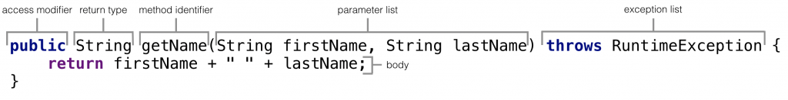

# Methods/Functions
- Một `method` là một `block code` chỉ chạy khi nó được gọi. Các `method` này được sử 
dụng để thực hiện một số hành động nhất định và chúng còn được gọi là các `function`.
- `Method` có thể truyền được dữ liệu vào, hay còn được gọi là tham số
- Tại sao phải sử dụng `methods`? Để reuse lại code: define code một lần và sử dụng 
nhiều lần.

## `Method Declaration`
- Một `method` phải được khai báo bên trong một `class`.
- Trong 1 `method` thường sẽ có tới 6 thành phần:
  - `Access Specifier:`định nghĩa kiểu truy cập của `methods`, tức là từ nơi nào mà 
  nó có thể được truy cập trong application. Trong Java, có 4 kiểu access specifier
    - `public`: Tất cả các `class` đều có thể truy cập được đến `method` này
    - `protected`: `method` này chỉ có thể truy cập được trong cùng một `package` hoặc 
    các `subclass`(class con) trong một `package` khác
    - `private`: `method` này chỉ có thể truy cập được trong `class` mà nó được defined.
    - `default`: Khi mà ko sử dụng bất cứ `access specifier`, Java sẽ gán 1 `default 
    access specifier` cho method đó. Nó có thể truy cập được trong cùng một `class` 
    và `package` chứa nó.
  - `Return Type:`là kiểu dữ liệu mà `method` trả về. Nó có thể có kiểu `primitive 
  data type`, `object`, `collection`, `void`, v.v. Nếu `method` không trả về bất cứ 
  thứ gì, chúng ta sử dụng từ khóa `void`.
  - `Parameter List:` Là danh sách các `paramater` được phân tách bằng dấu phẩy`,`và 
  được đặt trong cặp dấu ngoặc đơn`()`. Nó chứa`data types`và tên `paramater`. Nếu phương 
  thức không có`paramater`, để trống dấu ngoặc đơn.
  - `Exception List:` Các `exceptions` method có thể `throw`.
  - `Method Body:` Chứa tất cả các hành động cần được thực hiện. Nó được đặt trong 
  cặp dấu ngoặc nhọn`{}`.

<p align = "center">
    
</p>

## `Naming a Method`
- Tên `method` phải là một động từ và bắt đầu bằng một chữ cái viết thường. Nếu tên 
`method` có nhiều hơn hai từ, từ đầu tiên phải là một động từ theo sau là tính từ 
hoặc danh từ và chữ cái đầu tiên của mỗi từ phải viết hoa chữ từ đầu tiên. Ví dụ:

```shell
Tên phương thức một từ: sum(), area()

Tên phương thức nhiều từ: areaOfCircle(), stringComparision()
```

Cũng có thể một`method`có cùng tên với một tên `method` khác trong cùng một lớp, nó 
được gọi là`method overloading.`

## `Types of Method`
- Có 2 dạng `method` trong Java

  ### `Predefined Method`
  - Là các `method` đã được defined trước trong các `Java class libraries.` Nó còn 
  được gọi là `standard library method` hoặc `built-in method`. Chúng ta có thể trực 
  tiếp sử dụng các `method` này chỉ bằng cách gọi chúng trong chương trình tại bất kỳ
  thời điểm nào, ví dụ như là .print(), .length(), .min(), .max(), .sqrt(), v.v.

  ```java
  public class Demo {  
    public static void main(String[] args) {
      // using the max() method of Math class  
      System.out.print("The maximum number is: " + Math.max(9,7));  
    }  
  }
  ```
  ```shell
  The maximum number is: 9
  ```
  
  ### `User-defined Method`
  - Là các`method`được viết bởi người dùng hoặc lập trình viên. Các`method`này được 
  chỉnh sửa để phù hợp với `requirement.`

  ```java
  public class Demo {
    public static void findEvenOdd(int num) {
      //method body  
      if (num % 2 == 0)
        System.out.println(num + " is even");
      else
        System.out.println(num + " is odd");
    }
  }
  ```
  
## `Method Calling`
- Để gọi một `method` trong Java, viết tên của `method` theo sau là hai dấu ngoặc đơn
`()` và dấu chấm phẩy`;`

```java
import java.util.Scanner;
public class Demo { 
    public static void findEvenOdd(int num) {
      //method body  
      if (num % 2 == 0)
        System.out.println(num + " is even");
      else
        System.out.println(num + " is odd");
    }
  public static void main (String[]args) {
    //creating Scanner class object     
    Scanner scan=new Scanner(System.in);
    System.out.print("Enter the number: ");
    //reading value from the user  
    int num=scan.nextInt();
    //method calling  
    findEvenOdd(num);
  }
}
```
```shell
Enter the number: 24
12 is even
```
```shell
Enter the number: 3
12 is odd
```

# `More Method Types`
## `Static Method`
- Một `method` có từ khóa `static` đứng trước được gọi là `static method`. Nói cách 
khác, một `method` thuộc về một `class` chứ không phải là `instance` của một `class` 
được gọi là một `static method`.
- Ưu điểm chính của`static method`là có thể gọi nó mà không cần tạo`object`. Nó được
gọi đến bằng cách sử dụng tên`class`.

```java
public class Display {
  static void show() {
    System.out.println("It is an example of static method.");
  }
  public static void main(String[] args) {
        show();  
    }
}  
```
```shell
It is an example of a static method.
```

## `Instance Method`
- `method` của `object` được tạo ra từ`class` được gọi là `instance method`. Nó là 
một `non-static` method được định nghĩa trong `class`. Trước khi gọi đến `instance 
method`, cần tạo một`object`cho`class`của nó.

```java
public class InstanceMethodExample {
  private int s;
  // 
  public int add(int a, int b) {
    s = a+b;
    //returning the sum  
    return s;
  }
  public static void main(String [] args) {  
    //Creating an object of the class  
    InstanceMethodExample obj = new InstanceMethodExample();  
    //invoking instance method   
    System.out.println("The sum is: "+obj.add(12, 10));  
    }
}  
```
```shell
The sum is: 22
```

## `Abstract Method`
-  `method`mà ko có`method body`được gọi là`abstract method.`Nói cách khác, ko có 
triển khai được thì là`abstract method.`Nó luôn được khai báo trong`abstract class`.
Nó có nghĩa là bản thân`class`phải`abstract` nếu như nó có`abstract method`. Để tạo 
một`abstract method,`chỉ đơn giản sử dụng từ khóa `abstract`.

```java
abstract class Demo { //abstract class  
    //abstract method declaration  
    abstract void display();  
}  
public class MyClass extends Demo {
    //method impelmentation
    void display() {
        System.out.println("Abstract method?");  
    }
    public static void main(String[]args) {
        //creating object of abstract class  
        Demo obj = new MyClass();  
        //invoking abstract method  
        obj.display();  
    }
}
```
```shell
Abstract method...
```