# GIỚI THIỆU NHỮNG CÚ PHÁP JAVA CƠ BẢN
<p align = "center">
    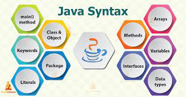
</p>


## Main method
 Điểm khởi đầu để chạy 1 phần mềm java.
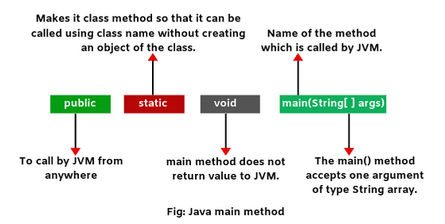

## Variable
Variable (biến) là 1 thùng chứa lưu giữ các giá trị khi chương trình java được thực thi.
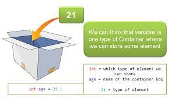

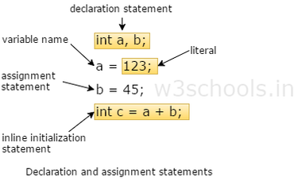

## Data type
 Type (kiểu dữ liệu) là 1 cách để phân loại variable
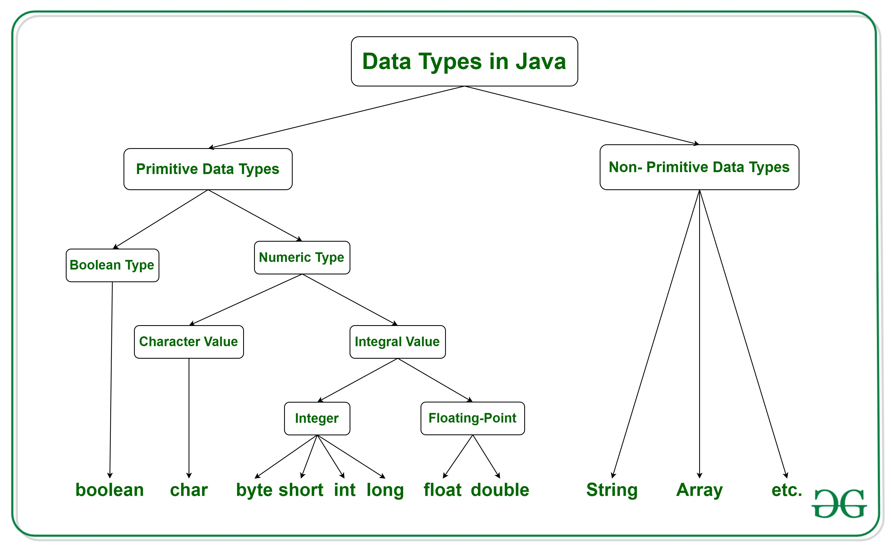

### Primative data type
Primative data type (kiểu dữ liệu nguyên thủy) là kiểu dữ liệu được định nghĩa trước bởi Java bao gồm: 
```java
Type	Size	Stores
byte	1 byte	whole numbers from -128 to 127
short	2 bytes	"" -32,768 to 32,767
int	4 bytes	"" -2,147,483,648 to 2,147,483,647
long	8 bytes	""-9,223,372,036,854,775,808 to 9,223,372,036,854,775,807
float	4 bytes	fractional numbers; for storing 6 to 7 decimal digits
double	8 bytes	fractional numbers; "" 15 ""
boolean	1 bit	true or false values
char	2 bytes	single character/letter or ASCII values

```
### Non-Primitive data type
Những dữ liệu tham chiếu đến object nên chúng còn được gọi là  reference types

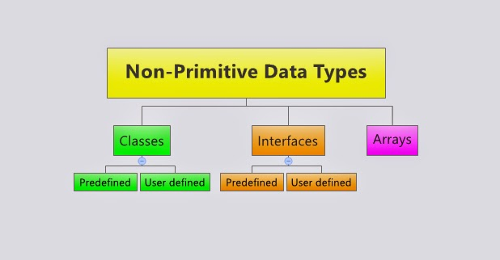
## Object
 Java là 1 ngôn ngữ OOP - hướng đối tượng vậy nên hiểu được đối tượng trong java là rất quan trọng.
Vậy thì đối tượng là gì, đối tượng là tất cả những thứ tồn tại xung quanh cuộc sống của chúng ta và khi mang khái niệm này vào lập trình cũng như vậy. Trong java,object sẽ bao gồm Attributes (đặc điểm, tính chất) và Methods (hành động)
 Đương nhiên là chúng ta không thể sờ nắm các đối tượng trong lập trình nhưng java sẽ cung cấp cho chúng ta những công cụ để tạo và điều khiển các object tương tác với nhau.

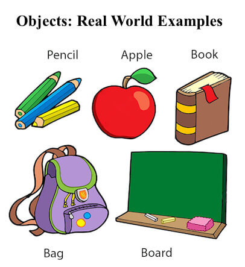

## Class
 Class chính là bản thiết kế để tạo nên các object. Chẳng hạn như Class Dog thì có thể sử dụng để tạo nên các thể loại object chó khác nhau. Mỗi chú chó sẽ là 1 object riêng biệt yourDog khác myDog, class là khuôn mẫu chung của Dog để tạo ra những chú chó khác nhau.
Các đặc điểm và hành động của 1 object dog sẽ được thể hiện qua Attributes và Methods
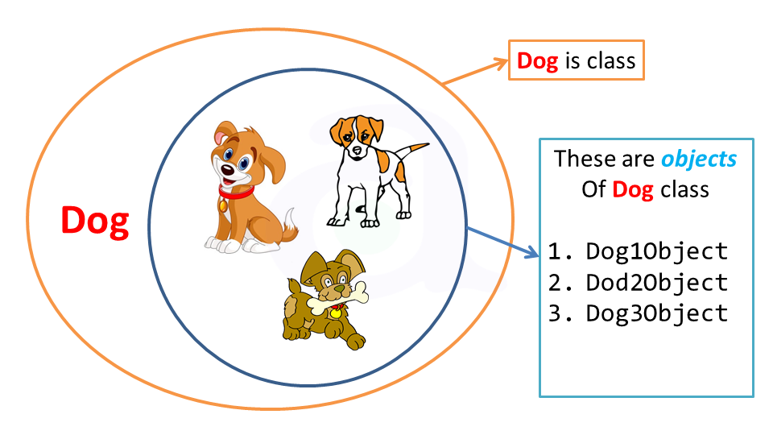
```java
public class Dog {
  private double weight;
  private double height;
  public void run(){
      System.out.println("Hey human am running :D");
  }
}
```
## Attribute
Attribute là variable thuộc về object
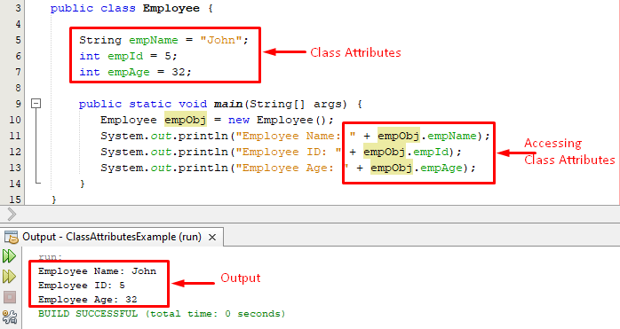

## Method
 Method (functions) là một khối code thực hiện những tác vụ cụ thể và sẽ chỉ thực thi khi được gọi, chúng ta có thể chuyền data vào trong method, những data này được gọi là parameters.
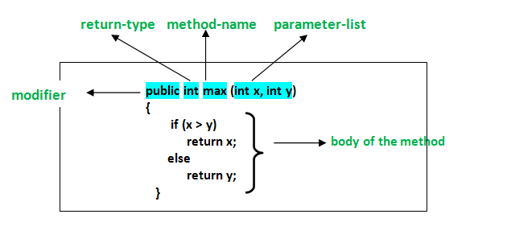

## Keywords
Những từ đã có ý nghĩa riêng nhất định trong java và không thể đem ra làm tên riêng cho variable, method, class ...
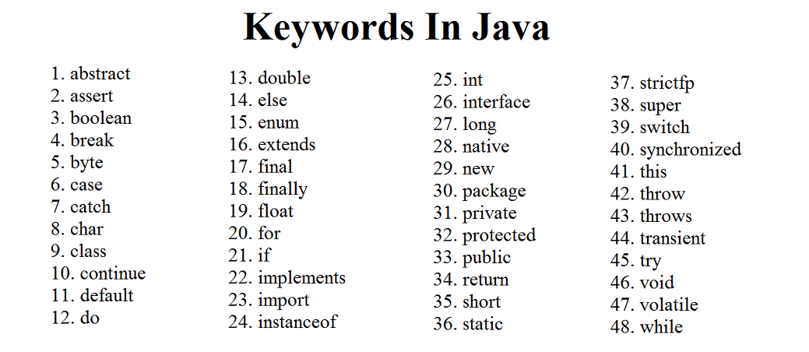
