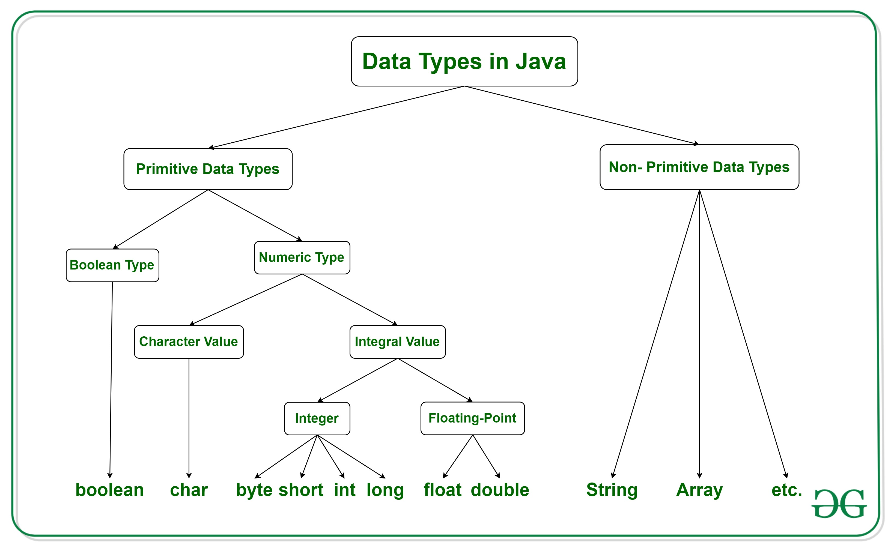

# Biến và kiểu dữ liệu
## Variable
Variable (biến) là 1 đơn vị lưu giữ các giá trị khi chương trình java được thực thi. 
<p align = "center">
    
</p>
Tất cả các biến trong Java đề được gán Data type.
<p align = "center">
    
</p>

Cách khai báo 1 biến.

<p align = "center">
    
</p>

Variable được chia làm 3 loại chính: Local, Instance and Static.

## Local Variable
Local Variable (biến cục bộ) là các variable được khai báo ở method, constructor, code block và các variable này chỉ có thể truy cập được ở nơi nó được khai báo.
```java
public class LocalVariableTest {
   public void show() {
      int num = 100; // local variable in method
       
       for(int i=0;i<10;i++){// local variable in block of code
           int u=0;// // local variable in block of code
       }
      System.out.println("The number is : " + num);
   }
    public LocalVariableTest() {
        String hello="hello";// local variable in constructor
    }
   public static void main(String args[]) {
      LocalVariableTest test = new LocalVariableTest();
      test.show();/// print The number is : 100
   }
}
```
## Instance Variable
Instance Variable các non-static variable được khai báo ở class và không trong method, constructor, code block. Đây là biến thuộc về object mà class sẽ tạo ra (class là bản vẽ tạo ra các object).
```java
package Edureka;
 
import java.util.Scanner;
 
public class Student
{
 
public String name; /// Instance Variable thuộc về object mà class (bản thiết kế) Student sẽ tạo ra
 
private int marks; /// Instance Variable 
 
public Student (String stuName) {
name = stuName;
}
public void setMarks(int stuMar) {
marks = stuMar;
}
 
// This method prints the student details.
public void printStu() {
System.out.println("Name: " + name );
System.out.println("Marks:" + marks);
}
 
public static void main(String args[]) {
Student stuOne = new Student("Ross");
Student stuTwo = new Student("Rachel");
Student stuThree = new Student("Phoebe");
 
stuOne.setMarks(98);
stuTwo.setMarks(89);
stuThree.setMarks(90);
 
StuOne.printStu();
StuTwo.printStu();
StuThree.printStu();
 
}
```
## Static Variable
Static Variable là variable được đánh dấu bằng từ khóa static, tất cả các variable được đánh dấu bởi từ khóa này đều thuộc về class (bản vẽ).
Biến static chỉ được khởi tạo 1 lần duy nhất khi ứng dụng java bắt đầu chạy. Static Variable thường được dùng để lưu giữ những dữ liệu dùng chung giữa các object.
```java
//Java Program to demonstrate the use of static variable  
class Student{  
   int rollno;//instance variable  
   String name;  
   static String college ="ITS";//static variable  
   //constructor  
   Student(int r, String n){  
   rollno = r;  
   name = n;  
   }  
   //method to display the values  
   void display (){System.out.println(rollno+" "+name+" "+college);}  
}  
//Test class to show the values of objects  
public class TestStaticVariable1{  
 public static void main(String args[]){  
 Student s1 = new Student(111,"Karan");  
 Student s2 = new Student(222,"Aryan");  
 //we can change the college of all objects by the single line of code  
 //Student.college="BBDIT";  
 s1.display();  
 s2.display();  
 }  
} 
```
## Data type
Type (kiểu dữ liệu) là 1 cách để phân loại variable. Data type được chia thành 2 loại Primitive Data Type (kiểu dữ liệu nguyên thủy)
và Non-Primitive Data Type 

### Primitive Data Type
Primitive Data Type (kiểu dữ liệu nguyên thủy) là những type cơ bản, nguyên thủy với size lưu trữ được định sẵn. Chúng là cơ sở để tạo lên các Non-Primitive Data Type.
```java
Type	Size	Stores
byte	1 byte	whole numbers from -128 to 127
short	2 bytes	-32,768 to 32,767
int	    4 bytes	-2,147,483,648 to 2,147,483,647
long	8 bytes	-9,223,372,036,854,775,808 to 9,223,372,036,854,775,807
float	4 bytes	fractional numbers; for storing 6 to 7 decimal digits
double	8 bytes	fractional numbers;
boolean	1 bit	true or false values
char	2 bytes	single character/letter or ASCII values
```
Khi 1 variable được khai báo với Primitive Data Type hãy tưởng tượng ta bỏ những dữ liệu nguyên thủy của ta vào những cái cốc (variable). Những chiếc cốc này sẽ có size to hay nhỏ tùy thuộc vào type mà nó được khai báo.
```java
float dataHolder1=32;
double dataHolder2=64;
```
<p align = "center">
    
</p>
Những primitive variable sẽ được lưu trữ ở vùng nhớ Stack (Stack memory).

<p align = "center">
    
</p>

### Non-Primitive Data Type
Non-Primitive Data Type những type được tạo bởi Class, Array, Interface, String.
<p align = "center">
    
</p>

Khi 1 variable được khai báo với Non-Primitive Data Type chúng được gọi là Reference Variable. Reference Variable không lưu trữ dữ liệu của object chúng lưu địa chỉ của object đó trong vùng nhớ.
Hãng tưởng tượng rằng những Reference Variable là những chiếc cốc chứa những chiếc điều khiển, những chiếc điều khiển này có thể điều khiển các object được lưu trữ ở vùng nhớ Heap (Heap space).

<p align = "center">
    
</p>

Như có thể thấy ở hình dưới đây. Các hành động (method, constructor) sẽ được lưu và sắp xếp theo thứ tự ở Call Stack. Tất cả các variable sẽ được lưu ở Stack Memory. Reference Variable lưu giữ địa chỉ (chiếc điều khiển) của object và
có thể gọi đến các object ở Heap Space.

<p align = "center">
    
</p>
