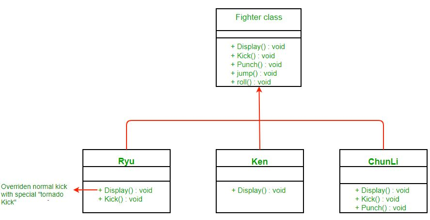

# Strategy
## Problem
- Bạn được công ty giao cho thiết kế một game Street Fighter, các nhân vật trong game sẽ có các hành động kick, punch, roll và jump.
Tất cả các nhân vật sẽ có kick và punch nhưng roll và jump là tùy chọn.

