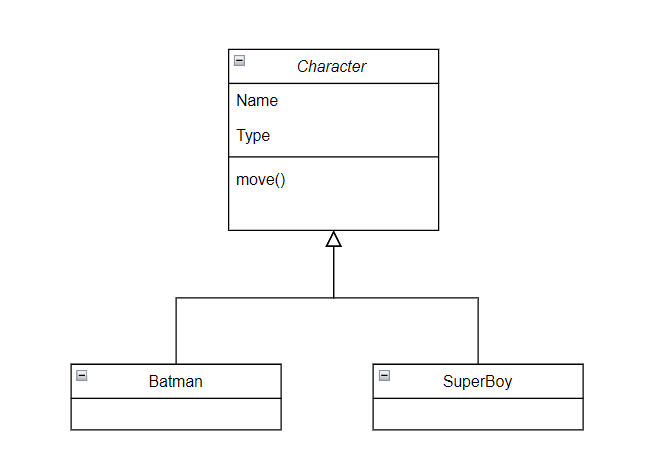
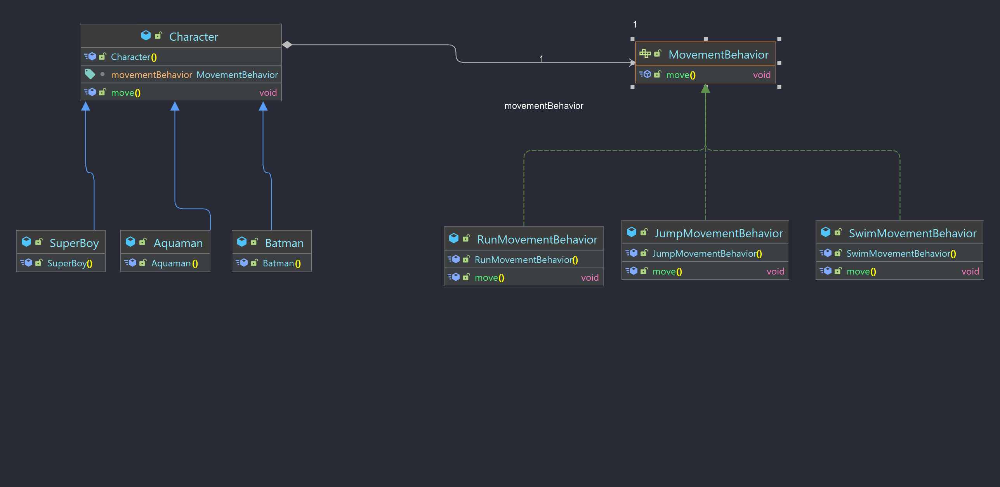

# Strategy

 

    

## Information
- Phân loại: `Behavior Pattern`
- Mục đích: Định nghĩa một tập hợp các thuật toán giống nhau, `encapsulate` chúng và khiến chúng có thể thay thế cho nhau. Strategy làm cho phần thuật toán độc lập khỏi `object` sử dụng nó.

## Problem 

    

- Gỉa sử chúng ta tạo ra 1 game đối kháng online, ban đầu lúc game mới tạo ra, các nhân vật có các move rất cơ bản. 
- Thiết kế code của các nhân vật sẽ có dạng là một `class` cha Character và 2 `class` con Batman và SuperBoy, `class` Character có một `method` move() và 2 `class` con sẽ `override` lại `method` đó cho phù hợp với nhân vật.

    

- Sau một vài bản update, `coder` được yêu cầu viết thêm các move() đặc biệt như bay, hay nhảy, một nhân vật còn không thể di chuyển để làm đa dạng lối chơi. Một số nhân vật khác lại vẫn có thể dùng chung move() của nhân vật cũ.
- Nếu cứ viết thêm code move() cho từng nhân vật cụ thể sẽ rất tốn công và không thể đảm bảo rằng nhân vật đó sẽ giữ nguyên cách move() trong tương lai.
- Vấn đề chúng ta đang đối diện là `method` đã có mối liên hệ quá chặt với `object`, trong cuộc sống khi muốn di chuyển chúng ta có rất nhiều lựa chọn, có thể đi tàu, xe máy, xe đạp ... chúng ta di chuyển rất flexible. 
Vậy tại sao lại không giúp các `class` nhân vật của chúng ta di chuyển flexible hơn nhỉ. 

## Solution
- Đây chính là lúc áp dụng `Strategy pattern`, hãy cùng xem thiết kế này có gì nào.

    

- Thiết kế bao gồm:
  - `Interface` gọi là `Strategy` chứa hàm để thực thi `method` mà chúng ta muốn flexible.
  - Các `class` (thuật toán) khác nhau sẽ triển khai `Interface Strategy` và viết lại `method` của `Interface`. Bây giờ ta đã có một `Interface` đại điện cho một hành động, khi cần chúng ta có thể chọn `method` mà chúng ta muốn qua các `class` triển khai `interface` này một cách dễ dàng.
  - `Class` Context là đại diện cho các `class` muốn sử dụng nhóm các `method` mà `Interface Strategy` cung cấp.

## Solution apply
- Áp dụng `Strategy pattern` vào problem trên ta có thiết kế sau.

    

