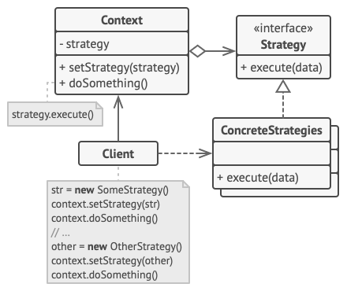

# Strategy

 

    

## Information
- Phân loại: `Behavior Pattern`
- Mục đích: Định nghĩa một tập hợp các thuật toán giống nhau, `encapsulate` chúng và khiến chúng có thể thay thế cho nhau. Strategy làm cho phần thuật toán độc lập khỏi `object` sử dụng nó.

## Problem 

    

- Gỉa sử chúng ta tạo ra 1 game đối kháng online, ban đầu lúc game mới tạo ra, các nhân vật có các move rất cơ bản. 
- Thiết kế code của các nhân vật sẽ có dạng là một `class` cha Character và 2 `class` con Batman và SuperBoy, `class` Character có một `method` move() và 2 `class` con sẽ `override` lại `method` đó cho phù hợp với nhân vật.

    

- Sau một vài bản update, `coder` được yêu cầu viết thêm các move() đặc biệt như bay, hay nhảy, một nhân vật còn không thể di chuyển để làm đa dạng lối chơi. Một số nhân vật khác lại vẫn có thể dùng chung move() của nhân vật cũ.
- Nếu cứ viết thêm code move() cho từng nhân vật cụ thể sẽ rất tốn công và không thể đảm bảo rằng nhân vật đó sẽ giữ nguyên cách move() trong tương lai.
- Vấn đề chúng ta đang đối diện là `method` đã có mối liên hệ quá chặt với `object`, trong cuộc sống khi muốn di chuyển chúng ta có rất nhiều lựa chọn, có thể đi tàu, xe máy, xe đạp ... chúng ta di chuyển rất flexible. 
Vậy tại sao lại không giúp các `class` nhân vật của chúng ta di chuyển flexible hơn nhỉ. 

## Solution
- Đây chính là lúc áp dụng `Strategy pattern`, hãy cùng xem thiết kế này có gì nào.

    

- Thiết kế bao gồm:
  - `Context`: `Class` sử dụng các `strategy object` và chỉ giao tiếp với các `strategy object` thông qua `interface`.
  - `Strategy`: Cung cấp một `interface` chung cho `context` giao tiếp với các `strategy object`.
  - `Concrete Strategy`: Implement các thuật toán khác nhau cho context sử dụng
  - `Client`: Có trách nhiệm tạo ra các `strategy object` và truyền vào cho `context` sử dụng.
## Solution apply
- Áp dụng `Strategy pattern` vào problem trên ta có thiết kế sau.

    

## Advantages and disadvantages
### Advantages
- Có thể thay thế các thuật toán linh hoạt với nhau
- Tách biệt phần thuật toán khỏi phần sử dụng thuật toán
- Có thể thay thế việc kế thừa bằng việc `encapsulate` thuật toán
- Tăng tính `open-closed`: Khi thay đổi thuật toán hoặc khi thêm mới thuật toán, không cần thay đổi code phần context.
### Disadvantages
- Không nên áp dụng nếu chỉ có một vài xử lý và hiếm khi thay đổi.
- Client phải nhận biết được sự khác biệt giữa các strategy.
