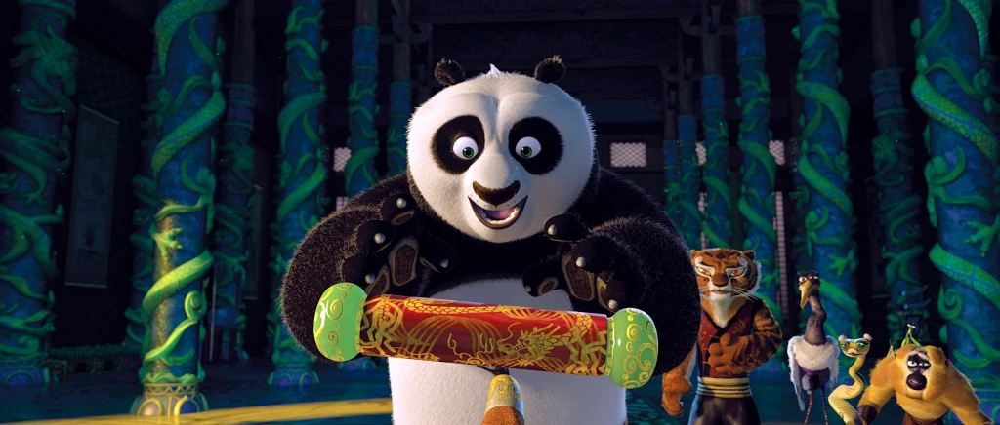
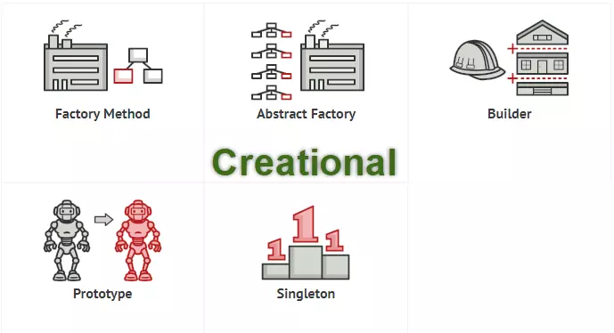
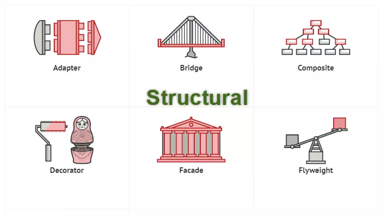
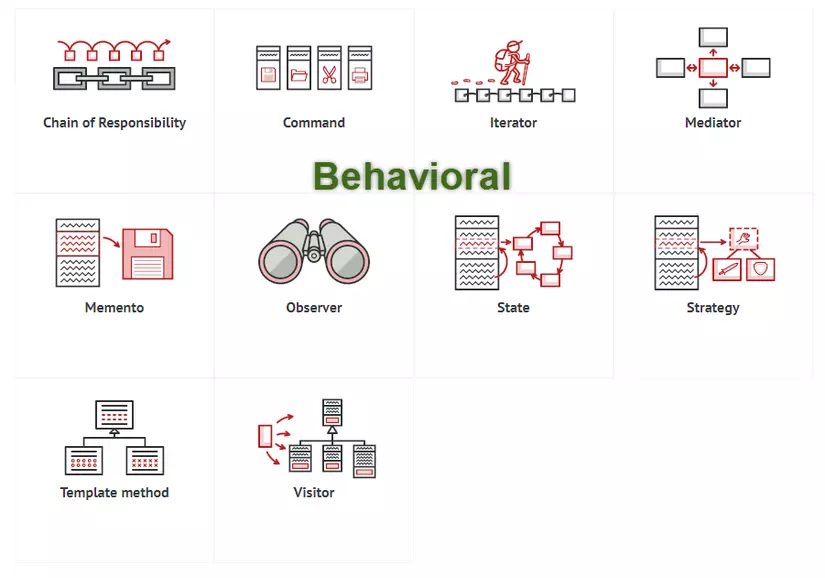

# Gang of Four Design Patterns
## Introduction
 

    

- Hello :grin:, DDBrogrammer chào mừng bạn đến với series Design Patterns. Trong series này chúng ta sẽ cùng nhau lĩnh hội bí kíp võ công của coder: `Gang of Four Design Patterns`.
- Vậy `Design patterns` là gì ? :thinking:. Trong giới lập trình thì các coder đang hành tẩu giang hồ đều sẽ phải gặp và giải quyết các vấn đề, trong quá trình này các coder 
tiền bối đã tổng hợp lại những bí kíp võ công, những mẫu thiết kế để giải quyết các vấn để thường gặp cho các coder thế hệ sau.
- Lĩnh hội được `Design patterns` sẽ giúp chúng ta giải quyết vấn đề nhanh và hiệu quả hơn.

## Be Careful

 

    

- Học một loại võ một cách gò bó, ép buộc rất dễ gây tẩu hỏa nhập ma. Đối với `Design patterns` học hời hợt, áp dụng sai hoặc không cần thiết cũng dễ gây ra phản tác dụng.
  - `Design patterns` không phải là giải pháp cho toàn bộ vấn đề khi lập trình. Chìa khóa là chúng ta phải hiểu vấn đề trước, sau đó mới lên kế hoạch đưa ra giải pháp, trong lúc tìm kiếm giải pháp mới xem xét đến `Design patterns`. 
  -  Võ công dù mạng nhưng cũng có thể đồng thời gây tổn hại cho người sử dụng. `Design patterns` có thể là giải pháp cho vấn đề hiện tại nhưng đồng thời có thể tạo ra thêm vấn đề mới.Hiểu được `Design patterns` và áp dụng một cách hợp lý, tối ưu là vô cùng quan trọng, nếu không `Design patterns` sẽ là con dao 2 lưỡi, khiến cho vấn đề trở nên phức tạp hơn.

## Types of Design Patterns
- `Design Patterns` được chia thành 3 loại, bao gồm:
  - `Creational`
  - `Structural`
  - `Behavioral`
### Creational Design Patterns

 

    

- `Creational Design Patterns` cung cấp một giải pháp để tạo ra các `object` và che giấu được logic của việc tạo ra nó.
- `Creational Design Patterns` bao gồm:
  - `Simple Factory`
  - `Factory Method`
  - `Abstract Factory`
  - `Builder`
  - `Prototype`
  - `Singleton`
### Structural Design Patterns

 

    

- `Structural Design Patterns` tập trung vào tổ chức, cấu trúc các `class` và thành phần của `object`.
- `Structural Design Patterns` bao gồm:
  - `Adapter`
  - `Bridge`
  - `Composite`
  - `Decorator`
  - `Facade`
  - `Flyweight`
  - `Proxy`
### Behavioral Design Patterns

 

    

- `Behavioral Design Patterns` dùng trong thực hiện các hành vi của `object`, sự giao tiếp giữa các `object` với nhau.
- `Behavioral Design Patterns` bao gồm:
  - `Chain of Responsibility`
  - `simplecommand.Command`
  - `Interpreter`
  - `Iterator`
  - `Mediator`
  - `Memento`
  - `Observer`
  - `State`
  - `Strategy`
  - `Template Method`
  - `Visitor`
